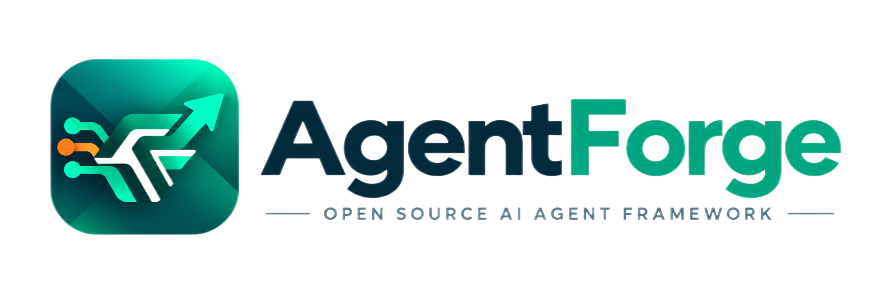

<p align="center">
  
</p>

# AgentForge

> **Forge Intelligence into Action.**
> **将智能锻造成行动。**

AgentForge 是一个面向 Java 开发者、从 **LLM 最底层能力开始构建** 的开源 Agent Framework。

它不从已经高度封装的 Agent API 起步，而是先建立稳定、统一、可扩展的模型抽象，再逐层向上构造
Tool、Memory、Middleware、Reasoning 与 Agent Runtime 等能力。

> **大模型提供原始智能，AgentForge 将这些智能能力逐层工程化，最终锻造成能够真正执行任务的 Agent。**

`AgentForge = Agent + Forge`：`Agent` 代表能理解目标、进行推理、调用工具并完成任务的智能体；`Forge`
强调把原始材料经过持续加工、塑形、强化，最终打造为真正可用的产品。

- 文档站：<https://changluya.github.io/AgentForge/>
- GitHub：<https://github.com/changluya/AgentForge>
- Gitee：<https://gitee.com/changluJava/agent-forge>

---

## 架构

AgentForge 采用 **Bottom-up** 的构建方式：先稳定最底层模型抽象，再逐层向上锻造 Agent 能力。

```text
LLM
 ↓  Message / Request / Response
 ↓  Context / Memory
 ↓  Tool / Skill / MCP
 ↓  Reasoning / Planning
 ↓  Agent Runtime
 ↓  Multi-Agent / Sandbox / Observability
Real Action
```

### 工程结构

```text
AgentForge
├── agentforge-ai-parent          # 统一依赖与插件版本管理
├── agentforge-ai-bom             # 统一 BOM 坐标维护
├── agentforge-model              # 模型层
│   ├── agentforge-model-api      # Provider 无关的模型契约与统一 req/vo
│   ├── agentforge-model-core     # 无厂商依赖的默认实现与执行引擎
│   ├── agentforge-model-openai   # OpenAI / OpenAI-compatible Provider
│   ├── agentforge-model-anthropic# Anthropic Provider
│   └── agentforge-model-registry # 开箱即用的 ChatModel 工厂
├── agentforge-framework
│   └── agentforge-agent-core     # ReAct Agent 运行时
├── agentforge-examples
│   └── agentforge-studio         # Web 可视化示例（Vue 2 前端 + Spring Boot 后端）
├── pom.xml
└── README.md
```

### 模块能力

| 模块 | 当前支持能力 |
| --- | --- |
| `agentforge-model-api` | 统一的 `ChatModel` / `StreamingChatModel` 契约，Message / Request / Response，工具契约与 HTTP Transport SPI |
| `agentforge-model-core` | 零依赖 HTTP Transport、内置 JSON、`@Tool` 反射执行与推理-工具循环引擎 |
| `agentforge-model-openai` | OpenAI Chat Completions 同步 / 流式、Function Calling、OpenAI-compatible endpoint |
| `agentforge-model-anthropic` | Anthropic Messages API 同步 / 流式、Tool Use |
| `agentforge-model-registry` | `LlmFactory` 按 provider 构建 ChatModel / StreamingChatModel |
| `agentforge-agent-core` | ReAct 主循环（同步 / 流式）、窗口记忆、工具调用回合、Middleware 链路、重试与取消 |
| `agentforge-studio` | 统一 SSE 协议的可视化对话示例 |

### 设计原则

1. **Bottom-up** — 先稳定 LLM / Message / Request / Response 等基础抽象，再构建 Agent。
2. **Provider-neutral** — 上层框架不被任何一家模型厂商协议绑定。
3. **Modular** — 核心抽象与 Provider / Framework / Agent Runtime 分模块演进。
4. **Lightweight** — 底层尽量减少不必要依赖，可被 Spring Boot、普通 Java、桌面端甚至嵌入式工程复用。
5. **Production-oriented** — 目标不是 Demo Agent，而是可以真正进入生产环境的 Agent Runtime。

### Roadmap

| 阶段 | 状态 | 内容 |
| --- | --- | --- |
| Phase 1 — LLM Foundation | ✅ 已完成 | 模型契约与 OpenAI / Anthropic Provider，稳定 Message / Request / Response |
| Phase 2 — LLM Capability | 🚧 进行中 | 流式、Tool Calling 已落地；Structured Output / Multimodal / Embedding / More Providers 规划中 |
| Phase 3 — Agent Foundation | 🚧 当前 | `model-registry`、`agent-core`；ReAct 主循环、窗口记忆、工具调用回合、Middleware |
| Phase 4 — Production Agent Runtime | ⏳ 规划中 | SubAgent / Multi-Agent / Sandbox / Human-in-the-loop / Tracing / Persistence |

---

## Quick Start

### 环境要求

> **推荐 JDK 17，兼容 JDK 8。**

- 日常开发与 CI 默认推荐 **JDK 17**；公共模块编译目标为 **Java 8 bytecode**，JDK 8 可直接依赖运行；
- 统一根包名与 `groupId` 均为 `io.github.agentforge`。

### 构建与依赖

```bash
git clone https://github.com/changluya/AgentForge.git
cd AgentForge
mvn clean install -DskipTests
```

```xml
<dependency>
    <groupId>io.github.agentforge</groupId>
    <artifactId>agentforge-agent-core</artifactId>
    <version>1.0.0-SNAPSHOT</version>
</dependency>
```

### 调用模型

```java
ChatModel model = OpenAiChatModel.builder()
        .apiKey(System.getenv("OPENAI_API_KEY"))
        .modelName("gpt-4o-mini")
        .build();

String answer = model.chat("Hello AgentForge");
```

`baseUrl` 可配置，因此也可作为 OpenAI-compatible Provider 使用（DashScope / Ollama / Xinference 等）。
需要流式输出时，使用 `StreamingChatModel` + `StreamingChatResponseHandler`。

### 构建 Agent

```java
ToolService toolService = new ToolService();
toolService.tools(new WeatherTools());   // 扫描对象中所有 @Tool 方法

ReActAgent agent = ReActAgent.builder()
        .agentName("weather-react-agent")
        .systemPrompt("你是一个天气助手。")
        .chatModel(chatModel)
        .streamingChatModel(streamingChatModel)
        .chatMemoryProvider(ChatMemoryProvider.windowChatMemoryProvider(50))
        .toolService(toolService)
        .build();

ChatResult result = agent.run(AgentRequest.builder()
        .memoryId("demo")
        .question("北京今天的天气怎么样？")
        .build());
```

流式执行通过 `agent.runStream(request)` 返回 `TokenStream`，可订阅文本 / 思考增量、工具执行与完成事件；
`agent.cancel(memoryId)` 用于取消任务。模型、记忆、工具与中间件均通过 Builder 注入，详见文档站。

### 运行 AgentForge Studio

```bash
# 后端（Spring Boot，默认 8080）
export AGENTFORGE_MODEL_API_KEY=your-api-key
mvn package -pl agentforge-examples/agentforge-studio/agentforge-studio-web -am -DskipTests
java -jar agentforge-examples/agentforge-studio/agentforge-studio-web/target/agentforge-studio-web-1.0.0-SNAPSHOT.jar

# 前端（Vue 2 + Vite，默认 5173，代理 /api 到 8080）
cd agentforge-examples/agentforge-studio/agentforge-studio-ui
npm install && npm run dev
```

详见 [agentforge-studio/README.md](agentforge-examples/agentforge-studio/README.md)。

### 测试

```bash
mvn clean test
```

单测默认不访问真实模型服务，通过可替换的 `HttpTransport` 与脚本化模型验证请求与响应，CI 无需配置 API Key。

---

## Questions

如果使用中遇到问题，欢迎通过以下方式反馈：

- GitHub Issue：<https://github.com/changluya/AgentForge/issues>
- Gitee Issue：<https://gitee.com/changluJava/agent-forge/issues>
- 文档站：<https://changluya.github.io/AgentForge/>

提 Issue 时请尽量附上环境信息（JDK / Maven 版本）、复现步骤与完整报错日志，便于快速定位。

---

## Contribution

欢迎参与 AgentForge 的建设，无论是代码、文档还是使用反馈。

1. Fork 本仓库并从开发分支切出特性分支；
2. 遵循项目代码规范（提交前会执行 Spotless 格式校验）；
3. 新增或修改能力时同步补充单元测试，并确保 `mvn clean test` 通过；
4. 提交 Pull Request，说明改动背景、方案与影响范围。

> 请勿将真实 API Key 写入源码或提交到仓库。

---

## Contributor

| Contributor | 说明 |
| --- | --- |
| [changlu](https://github.com/changluya) | 作者 / Maintainer |

欢迎你的名字出现在这里。

---

## License

AgentForge is released under the [MIT License](LICENSE).

---

> **Models provide intelligence. AgentForge turns intelligence into action.**
> 模型提供智能，AgentForge 负责将它一步步锻造成真正能够行动的 Agent。
