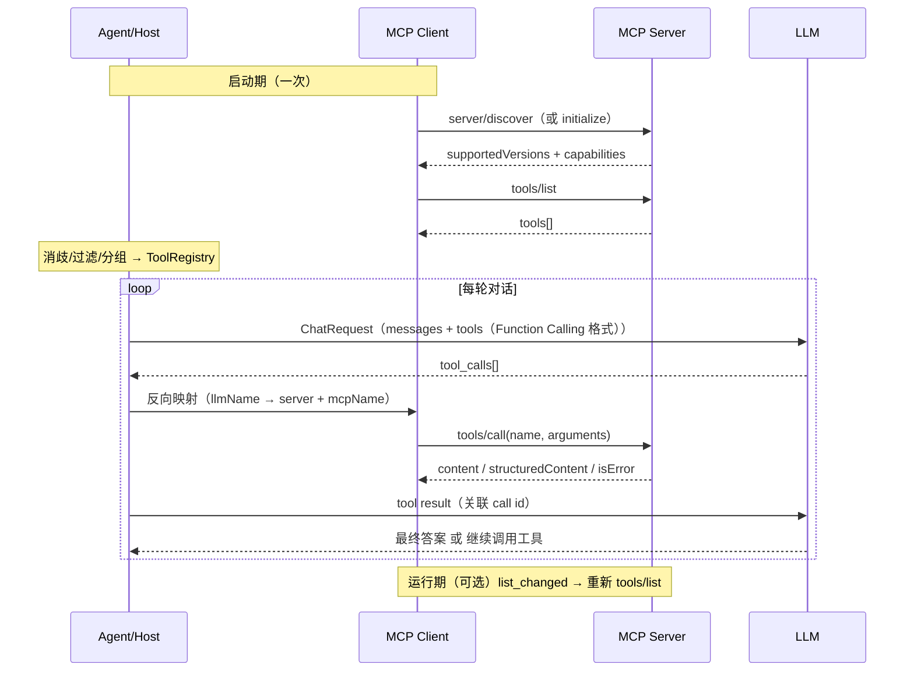

# MCP 协议详解：历史演进、协议设计与 Client/Server 底层原理

> 一句话概括：MCP（Model Context Protocol，模型上下文协议）是 Anthropic 在 2024 年底开源、现由 Linux 基金会下 Agentic AI Foundation 治理的开放标准。它用一套统一的 JSON-RPC 协议，把「工具/资源/提示词」从每一个 AI 应用里解耦出来，做成可插拔的 Server，从而把「AI 应用 × 外部能力」的集成成本从 M×N 降到 M+N。

{/* truncate */}


<br/>

本文是一篇 MCP 协议专题：从它的**由来与版本历史**讲起，逐步展开**核心概念、协议设计、Client/Server 底层原理**，并给出**基于 Java 的 Client/Server 快速搭建**与**对接 Agent 的设计流程**，最后落到**安全机制、扩展治理与设计权衡**。

> 官方入口：[规范文档 modelcontextprotocol.io](https://modelcontextprotocol.io) ｜ [官方博客](https://blog.modelcontextprotocol.io) ｜ [GitHub 组织](https://github.com/modelcontextprotocol) ｜ [官方注册中心](https://registry.modelcontextprotocol.io) ｜ [Java SDK](https://github.com/modelcontextprotocol/java-sdk)

---

## 一、背景与问题引入

### 1.1、场景驱动：一个真实的集成难题

在开发一个 AI Agent 产品的过程中，我们就遇到了这样一个具体问题：

> 用户希望 Agent 能查天气、查数据库、读 GitHub、发钉钉消息……而这些能力，团队里不同的同学已经用不同语言、不同框架写好了一堆「工具服务」。有的用 Python 写、有的用 Node 写、有的干脆就是一段 shell。  
> 问题是：**每接一个工具，Agent 应用就要为它写一次适配代码**。工具一多，应用端就成了一个大杂烩：一会儿要引入 Python 进程，一会儿要封装 HTTP，一会儿要写 JSON Schema。换个模型厂商，Schema 格式又不一样，全部重来。

这不是某一家产品的痛点，而是整个行业的痛点。MCP 正是为它而生。

<br/>

### 1.2、Function Calling 的「M × N 集成灾难」

在 MCP 出现之前，主流做法是各家模型厂商的 **Function Calling / Tool Use**：

- OpenAI 用 `tools[].function.{name,description,parameters}`
- Anthropic 用 `tools[].{name,description,input_schema}`
- 各家 Prompt 模板、强制调用参数、并行调用能力都不完全一致

于是形成一个典型的 **M × N 问题**：

```text
M 个 AI 应用（Host / Agent 框架）
        ×
N 个外部工具（DB、GitHub、Slack、文件系统……）
        =
M × N 份适配代码
```

每一次新增工具，都要在 M 个应用里重复接入；每一次新增应用，都要重新对接 N 个工具。**成本随规模平方级增长。**

<br/>

### 1.3、设计灵感：来自 LSP 的类比

MCP 的架构范式直接承袭 **LSP（Language Server Protocol）**：

```text
LSP：M 个编辑器 × N 种编程语言  →  M + N（协议居中）
MCP：M 个 AI 应用 × N 个外部能力 →  M + N（协议居中）
```

正如 LSP 让「编辑器」与「语言服务」通过统一协议解耦，MCP 让「AI 应用」与「外部能力」通过统一协议解耦。这个类比是理解 MCP 一切设计的钥匙——**Host 管编排、Server 管能力、协议管通信**。

<br/>

### 1.4、本文要回答的问题

1. MCP 从哪里来？治理如何演进？<br/>
2. 它有哪些版本？每个版本改了什么？<br/>
3. 当前（2026-07-28）的协议设计全貌是什么？<br/>
4. 一个 MCP Client / Server 内部是怎么跑起来的？<br/>
5. 这些设计背后有哪些权衡？

---

## 二、起源与版本历史

### 2.1、发布与开源

- **2024-11-05**：MCP 首个规范版本发布，定义 client-server 架构、JSON-RPC 2.0、`tools`/`resources`/`prompts` 三大原语，以及 `stdio` 与 `HTTP+SSE` 两种传输。
- **2024-11-25**：Anthropic **公开宣布并开源** MCP，同时发布 Python / TypeScript SDK 与 Google Drive、Slack、GitHub、Git、Postgres 等参考 Server。

> **注意**：版本号 `2024-11-05` 早于公开宣布日 `2024-11-25`。这是因为 MCP 采用**日期型版本号**，其含义是「**最后一次包含不兼容变更的日期**」，而非发布日。

<br/>

### 2.2、版本号与状态规则

- 版本标识形如 `YYYY-MM-DD`；协议版本**不因向后兼容的更新而递增**。
- 每个修订有三种状态：**Draft**（草稿）、**Current**（当前）、**Final**（已定稿）。
- 单个特性还可被标记为 **Deprecated**（弃用），受正式的**特性生命周期与弃用策略**约束（2026-07-28 引入，至少 12 个月弃用窗口）。

<br/>

### 2.3、版本时间线与采用里程碑

| 日期 | 事件 | 类型 |
|---|---|---|
| 2024-11-05 | 首个规范 `2024-11-05`：client-server、JSON-RPC 2.0、tools/resources/prompts、stdio + HTTP+SSE | 规范修订 |
| 2024-11-25 | Anthropic 宣布并开源 MCP，发布 Python / TS SDK 与参考 Server | 发布 |
| 2025-03-19 | Microsoft 在 Copilot Studio 引入 MCP 支持 | 采用 |
| 2025-03-26 | 规范 `2025-03-26`：OAuth 2.1 授权、Streamable HTTP 取代 HTTP+SSE、工具注解、音频、补全、JSON-RPC 批处理 | 规范修订 |
| 2025-03-26 | OpenAI 在 Agents SDK 引入 MCP | 采用 |
| 2025-04-09 | Google Gemini 承诺支持 MCP | 采用 |
| 2025-05-19 | Microsoft 在 Build 2025 全面支持 MCP；微软与 GitHub 加入指导委员会 | 治理/采用 |
| 2025-05-21 | OpenAI 在 Responses API 支持远程 MCP Server，加入指导委员会 | 采用/治理 |
| 2025-06-18 | 规范 `2025-06-18`：结构化工具输出、elicitation、资源链接；移除 JSON-RPC 批处理；`MCP-Protocol-Version` 头 | 规范修订 |
| 2025-09-05 | 官方 PHP SDK 发布 | 生态 |
| 2025-09-08 | 官方 MCP Registry 预览发布 | 生态 |
| 2025-11-25 | 规范 `2025-11-25`（一周年）：OpenID Connect Discovery、图标、标准枚举 elicitation、sampling 支持工具调用、实验 Tasks、JSON Schema 2020-12 | 规范修订 |
| 2025-12-09 | Anthropic 将 MCP 捐赠给 Linux 基金会下新成立的 Agentic AI Foundation（AAIF） | 治理 |
| 2026-01-26 | MCP Apps 作为首个官方扩展发布 | 扩展 |
| 2026-05-21 | 下一版 `2026-07-28` 发布候选（Release Candidate） | 规范修订 |
| 2026-06-29 | 四个一级（Tier 1）SDK 发布实现该候选版的 Beta 版本 | 生态 |
| 2026-07-28 | 规范 `2026-07-28` 成为 **Current**；四个一级 SDK 同日支持 | 规范修订 |

<br/>

### 2.4、各版本关键设计变化

**`2025-03-26`：传输与授权的大跨步**

- 新增 **OAuth 2.1** 授权框架；
- 用 **Streamable HTTP** 取代 HTTP+SSE（当时仍保留 session：`Mcp-Session-Id` 头、可 GET 打开独立 SSE 流、可用 `Last-Event-ID` 恢复）；
- 新增工具注解、音频内容、参数补全、JSON-RPC 批处理。

**`2025-06-18`：结构化输出与安全定位**

- 新增**结构化工具输出**（`outputSchema` / `structuredContent`）、**elicitation**（服务端向用户索要输入）、工具结果中的**资源链接**；
- 把 MCP Server 明确定位为 **OAuth Resource Server**，要求 **Resource Indicators（RFC 8707）**；
- **移除 JSON-RPC 批处理**；
- 要求后续 HTTP 请求携带 `MCP-Protocol-Version` 头。

**`2025-11-25`：一周年版本**

- 授权服务端发现增强为 **OpenID Connect Discovery 1.0**，支持通过 `WWW-Authenticate` 做增量授权范围同意；
- 工具/资源/模板/提示词支持**图标元数据**；
- elicitation 枚举改为标准化的 titled/untitled/单/多选与 URL 模式；
- sampling 支持工具调用；新增 **OAuth Client ID Metadata Documents** 注册机制；
- 引入**实验性 Tasks**；确立 **JSON Schema 2020-12** 为默认方言。

**`2026-07-28`：无状态化范式修订（当前版本）**

被称为「发布以来最大修订」，要点：**无状态核心、移除握手与 session、`server/discover`、MRTR、订阅流、扩展框架、授权加固、正式弃用策略**。详见第四章。

<br/>

### 2.5、治理

- 2025 年起，Microsoft、GitHub、OpenAI 等先后加入 MCP 指导委员会；
- 2025-12-09，Anthropic 将 MCP **捐赠**给 Linux 基金会下新建的 **Agentic AI Foundation（AAIF）**（由 Anthropic、Block、OpenAI 共同发起），官方声明治理模型不变；
- 规范采用 **SEP（Specification Enhancement Proposal）** 的 PR 工作流。

---

## 三、核心概念

### 3.1、Host / Client / Server 三角色

MCP 采用 **client-host-server** 架构，注意这里有两个「C」，容易混淆：

```text
┌──────────────────────────────────────────────────────────┐
│  Host 进程（AI 应用，如 Claude Desktop / IDE / Agent 框架） │
│   ├── Client 1  ──1:1──►  Server 1（本地文件 & Git）       │
│   ├── Client 2  ──1:1──►  Server 2（数据库）               │
│   └── Client 3  ──1:1──►  Server 3（远程 SaaS API）        │
└──────────────────────────────────────────────────────────┘
```

- **Host（宿主）**：创建并管理多个 Client，控制连接权限与生命周期，执行安全策略与用户授权决策，聚合上下文给 LLM。
- **Client（客户端）**：由 Host 创建，**与某一个 Server 严格 1:1**；对每个请求附带协议版本与能力；双向路由消息；管理订阅与通知；维持 Server 间的安全边界。
- **Server（服务端）**：通过原语对外暴露具体能力，独立、单一职责；可以是本地进程，也可以是远程服务。

> **重点**：MCP 是**无状态协议**——每个请求自带处理所需的全部信息（版本、能力、身份），Server 不得依赖连接或先前请求推断状态。

<br/>

### 3.2、三大 Server 原语与控制权

| 原语 | 由谁控制 | 用途 | 对应方法 |
|---|---|---|---|
| **Tools** | **模型控制**（model-controlled） | 可被 LLM 调用的函数 | `tools/list`、`tools/call` |
| **Resources** | **应用控制**（application-controlled） | 可读上下文，按 URI 标识 | `resources/list`、`resources/read` |
| **Prompts** | **用户控制**（user-controlled） | 可复用的提示词模板 | `prompts/list`、`prompts/get` |

设计上三者的「控制权」明显不同：工具由模型自主决定调用，资源由应用决定何时注入上下文，提示词由用户显式选择。

<br/>

### 3.3、四条设计原则

1. **Server 应极易构建**：复杂编排由 Host 承担，Server 只专注单一能力。
2. **Server 应高度可组合**：多个 Server 可无缝组合，共享同一协议。
3. **Server 不能读整个对话、也看不到其他 Server**：完整对话历史只留在 Host；Server 之间相互隔离，跨 Server 交互由 Host 控制。
4. **特性可渐进添加**：核心协议最小化，其他能力按需声明与协商。

<br/>

### 3.4、能力协商（Capability Negotiation）

能力协商是 MCP 的核心机制，但**协商方式在 2026-07-28 发生了根本变化**：

- **旧模型（≤ 2025-11-25）**：通过 `initialize` 握手，一次性交换并确定整个 session 的能力。
- **新模型（2026-07-28）**：无握手；客户端在**每个请求**的 `_meta.io.modelcontextprotocol/clientCapabilities` 中声明能力；服务端通过 [`server/discover`](https://modelcontextprotocol.io/specification/2026-07-28/server/discover) 一次性公布其支持的版本与能力。

典型能力：服务端 `tools` / `resources` / `prompts` / `logging` / `completions`；客户端 `roots` / `sampling` / `elicitation`。

> **重要规则**：服务端 **MUST NOT** 依赖客户端未声明的能力；若处理某请求需要客户端未声明的能力，服务端 **MUST** 返回 `-32021 MissingRequiredClientCapability` 并在 `data.requiredCapabilities` 中列出。

---

## 四、协议核心设计

### 4.1、消息模型：JSON-RPC 2.0

MCP 所有消息都遵循 **JSON-RPC 2.0**，且消息 **MUST** 为 UTF-8。消息类型：

```jsonc
// 1) Request：请求，MUST 带非 null 的 id（不得与未响应的请求 id 重复）
{ "jsonrpc": "2.0", "id": 1, "method": "tools/call", "params": { /* ... */ } }

// 2) Result Response：成功响应，MUST 带 resultType（2026-07-28 起）
{ "jsonrpc": "2.0", "id": 1, "result": { "resultType": "complete", "content": [ /* ... */ ] } }

// 3) Error Response：失败响应，MUST 带 code 与 message
{ "jsonrpc": "2.0", "id": 1, "error": { "code": -32602, "message": "Invalid params" } }

// 4) Notification：通知，MUST NOT 带 id
{ "jsonrpc": "2.0", "method": "notifications/tools/list_changed" }
```

> **设计要点**：MCP 规定「**客户端只发请求/通知，服务端只发响应/通知**」——服务端不主动发请求（2026-07-28 之后），客户端不发响应。这一约束是无状态与单向流设计的基石。

<br/>

### 4.2、`_meta`：请求级协议元数据

所有协议元数据随**消息体**携带（传输层可选地镜像到信封头）。客户端请求的 `_meta` 字段：

| 键 | 类型 | 必填 | 说明 |
|---|---|---|---|
| `io.modelcontextprotocol/protocolVersion` | string | 是 | 本次请求使用的协议版本 |
| `io.modelcontextprotocol/clientCapabilities` | object | 是 | 客户端相关能力 |
| `io.modelcontextprotocol/clientInfo` | object | 否 | 客户端名称与版本（SHOULD） |
| `io.modelcontextprotocol/logLevel` | string | 否 | 本请求的最小日志级别 |

服务端 **SHOULD** 在每个结果的 `_meta` 中回 `io.modelcontextprotocol/serverInfo`。此外 `traceparent` / `tracestate` / `baggage` 被保留用于 OpenTelemetry 追踪上下文。

> **重点**：`protocolVersion` 与 `clientCapabilities` 缺失即为**畸形请求**，服务端 **MUST** 以 `-32602` 拒绝（HTTP 上返回 `400 Bad Request`）。这就是「请求自描述、不依赖连接状态」的具体落地。

<br/>

### 4.3、`resultType`：多态结果设计

2026-07-28 为所有结果引入**必填**的 `resultType`：

- `"complete"`：正常完成，`result` 含最终内容；
- `"input_required"`：需要客户端补充输入（见 4.8 MRTR）；
- 扩展可新增其他 `resultType`，但必须来自核心集合或已声明扩展；
- 客户端遇无法识别的 `resultType` **MUST** 视为非法；
- 对不返回 `resultType` 的旧版服务端，客户端 **MUST** 按 `"complete"` 处理。

<br/>

### 4.4、错误模型与错误码

MCP 将错误分为两类，**处理方式不同**：

| 类型 | 含义 | 返回方式 | 模型可自纠 |
|---|---|---|---|
| **Protocol Error** | 请求结构问题（未知工具、畸形请求、服务端错误） | JSON-RPC `error` 对象 | 通常不能 |
| **Tool Execution Error** | 业务/API/校验错误 | `result.isError = true` + 文本 | **能** |

错误码分区策略：

- `-32700`、`-32600`~`-32603`：标准 JSON-RPC 通用错误；
- `-32000`~`-32019`：**遗留**实现自定义区（新实现不应再分配）；
- `-32020`~`-32099`：**保留给 MCP 规范**（见 [Schema 错误定义](https://modelcontextprotocol.io/specification/2026-07-28/schema)）。2026-07-28 定义：

| 码 | 名称 |
|---|---|
| `-32020` | `HeaderMismatch` |
| `-32021` | `MissingRequiredClientCapability` |
| `-32022` | `UnsupportedProtocolVersion` |

历史码 `-32002`（资源未找到，≤2025-11-25）被 `-32602` 取代，但客户端**SHOULD** 仍兼容旧服务端的 `-32002`。

<br/>

### 4.5、传输设计

协议语义在所有传输上一致；传输只负责「分帧、投递、取消、终止」。标准传输有两种：

**stdio**（[规范](https://modelcontextprotocol.io/specification/2026-07-28/basic/transports/stdio)）

- Client 以子进程方式启动 Server，通过其标准流通信；
- 每个消息一行 JSON，**不得内嵌换行**；
- Server **MUST NOT** 往 `stdout` 写非 MCP 消息；日志走 `stderr`；
- 取消：发 `notifications/cancelled`（单通道，无 per-request stream）；
- 关闭：关 stdin → 等退出 → `SIGTERM` → `SIGKILL`（Windows 用 `TerminateProcess`/Job Objects）。

**Streamable HTTP（2026-07-28 形态）**（[规范](https://modelcontextprotocol.io/specification/2026-07-28/basic/transports/streamable-http)）

- 单一 **MCP endpoint**，只用 **POST**；每个请求独立一个 POST；
- 请求头 MUST 含 `Accept: application/json, text/event-stream`、`MCP-Protocol-Version`、`Mcp-Method`，`tools/call`/`resources/read`/`prompts/get` 还要 `Mcp-Name`；
- 响应可为单个 JSON，或**请求级 SSE 流**（先推通知，最后一条是最终响应）；
- 取消 = 关闭该请求的响应流；
- 2026-07-28 **移除**：HTTP GET 流、`Mcp-Session-Id`、`Last-Event-ID` 可恢复性。

```http
POST /mcp HTTP/1.1
Content-Type: application/json
Accept: application/json, text/event-stream
MCP-Protocol-Version: 2026-07-28
Mcp-Method: tools/call
Mcp-Name: get_weather

{ "jsonrpc": "2.0", "id": 1, "method": "tools/call",
  "params": { "name": "get_weather", "arguments": { "location": "Seattle, WA" },
    "_meta": { "io.modelcontextprotocol/protocolVersion": "2026-07-28",
               "io.modelcontextprotocol/clientCapabilities": {} } } }
```

> **弊端说明**：旧版 HTTP+SSE（2024-11-05）自 2025-03-26 被取代，2026-07-28 正式归入 **Deprecated**，新实现不应采用。
>
> **注意**：`x-mcp-header` 允许把原始类型参数（string/integer/boolean，不含 number）镜像成 `Mcp-Param-{Name}` 头，便于网关路由；但头对中间网络可见，**不得**标记密码/Token/PII。

<br/>

### 4.6、生命周期：legacy 握手 vs modern 逐请求

**Legacy（≤ 2025-11-25）**：

```text
initialize → 服务端返回能力 → notifications/initialized → 正常操作 → 关闭
```

`initialize` 请求/响应结构：

```json
// 请求
{ "jsonrpc": "2.0", "id": 1, "method": "initialize",
  "params": { "protocolVersion": "2025-06-18",
              "capabilities": { "roots": { "listChanged": true }, "sampling": {} },
              "clientInfo": { "name": "ExampleClient", "version": "1.0.0" } } }

// 响应
{ "jsonrpc": "2.0", "id": 1,
  "result": { "protocolVersion": "2025-06-18",
              "capabilities": { "tools": { "listChanged": true } },
              "serverInfo": { "name": "ExampleServer", "version": "1.0.0" } } }
```

**Modern（2026-07-28）**：无握手；版本与能力随每个请求的 `_meta` 携带；`server/discover` 可选，用于一次性获取版本/能力/身份。

**双时代兼容**是现实刚需（新旧 Server 并存），官方给出探测机制：

- stdio：先发 `server/discover`；成功 → 现代；返回非现代错误或超时 → 回退 `initialize`；
- HTTP：先发现代请求；遇 `400` 先看响应体——可识别的现代错误 → 现代；否则回退 `initialize`。

> **注意**：时代判定是**服务端属性**，应缓存（stdio 按进程、HTTP 按 origin），避免每请求探测。

<br/>

### 4.7、无状态化设计（2026-07-28 核心）

| 变化 | 说明 |
|---|---|
| 移除 session 与 `Mcp-Session-Id` | 请求可由任意 Server 实例处理，适配无状态部署 |
| 移除 `initialize`/`initialized` 握手 | 版本与能力改为每请求 `_meta` |
| 新增 `server/discover` | 一次性公布 supportedVersions / capabilities / identity |
| 列表端点不再随连接变化 | `tools/list` 不因连接而异，但可因授权凭据而异 |

无状态的直接要求：**跨调用的状态**必须由 Server **显式**返回一个 handle（如 `basket_id`），并在后续调用中由客户端作为普通参数传回。协议本身没有「状态句柄」概念——从线缆视角看，它只是一个普通字符串。

<br/>

### 4.8、MRTR：多轮往返请求

旧版允许 Server 通过 SSE 流**主动**发请求（`sampling/createMessage`、`elicitation/create`、`roots/list`）。2026-07-28 改为：

- Server 在响应里返回 `InputRequiredResult`（`resultType: "input_required"`），`inputRequests` 字段描述所需输入；
- Client 补齐后，用**新的 id** 重放原请求，并在 `params.inputResponses` 中带回答案（可带 `requestState` 透传服务端状态）。

```text
Client ── tools/call(id:1) ──► Server
Client ◄─ InputRequiredResult（inputRequests: elicitation/create）── Server
Client ── tools/call(id:2, 原参数 + inputResponses) ──► Server
Client ◄─ 最终 result ── Server
```

> **重点**：MRTR（[Multi Round-Trip Requests](https://modelcontextprotocol.io/specification/2026-07-28/basic/patterns/mrtr)，SEP-2322）把「服务端反向请求」改造为「客户端主动重试」，从而与无状态模型自洽。

<br/>

### 4.9、订阅与通知

2026-07-28 用**长生命周期的 POST 响应流** [`subscriptions/listen`](https://modelcontextprotocol.io/specification/2026-07-28/basic/patterns/subscriptions) 取代旧的 GET 流与 `resources/subscribe`：

- Client 声明订阅类型（`toolsListChanged`、`promptsListChanged`、`resourcesListChanged`、`resourceSubscriptions`）；
- Server 先回 `notifications/subscriptions/acknowledged`，随后在该流推送变更通知；
- 每条通知带 `_meta.io.modelcontextprotocol/subscriptionId` 关联来源订阅。

> **注意**：请求级通知（`notifications/progress`、`notifications/message`）只走**该请求自己的响应流**。另外，2026-07-28 移除了 SSE 可恢复性，断流即丢请求。

<br/>

### 4.10、列表与缓存

- [`tools/list`](https://modelcontextprotocol.io/specification/2026-07-28/server/tools)、`prompts/list`、`resources/list` 等支持**分页**（`cursor` / `nextCursor`）与**缓存**；
- 2026-07-28 要求列表/读取结果带 `ttlMs`（新鲜度提示）与 `cacheScope`（`public`/`private`，控制共享中间层是否可缓存）；
- Server **SHOULD** 稳定排序，便于客户端缓存与 LLM Prompt Cache 命中；
- 工具定义包含 `name`、`title`、`description`、`inputSchema`（默认 JSON Schema 2020-12）、可选 `outputSchema`、`icons`、`annotations`。

**工具定义与调用示例：**

```json
// tools/list → tools[]
{ "name": "get_weather",
  "title": "Weather Information Provider",
  "description": "Get current weather information for a location",
  "inputSchema": { "type": "object",
    "properties": { "location": { "type": "string", "description": "City name or zip code" } },
    "required": ["location"] },
  "outputSchema": { "type": "object", "properties": { "temperature": { "type": "number" } } } }
```

```json
// tools/call 成功响应（非结构化文本 + 结构化内容并存）
{ "jsonrpc": "2.0", "id": 2, "result": {
  "resultType": "complete",
  "content": [{ "type": "text", "text": "{\"temperature\": 22.5, \"conditions\": \"Partly cloudy\"}" }],
  "structuredContent": { "temperature": 22.5, "conditions": "Partly cloudy" },
  "isError": false
}}
```

> **注意**：工具名 1~128 字符、区分大小写、仅允许 `A-Za-z0-9_-` 与 `.`，且在**单个 Server 内唯一**；`inputSchema` **MUST** 是合法 JSON Schema（不能为 `null`）；无参数工具推荐 `{ "type": "object", "additionalProperties": false }`。

---

## 五、核心 MCP Client / Server 的底层原理

> **本节回答**：抛开框架，MCP 客户端/服务端内部到底怎么跑？

### 5.1、消息编解码与请求关联

无论是 stdio 还是 HTTP，客户端核心都是一张 **`id → 等待中的 Future`** 路由表：

```text
发送请求：  id = nextId++; pending.put(id, future);  transport.send(jsonRpcRequest)
收到消息：  if 有 id 且 有 result/error  → pending.remove(id).complete(...)
           if 无 id 且 method=notifications/* → 交给通知分发器
```

以 LangChain4j 为例，`McpOperationHandler` 内部就是 `Map<Long, CompletableFuture<JsonNode>>`：收到「带 id 且带 result/error」的消息就完成对应 Future；收到 `ping` 请求就回 `McpPingResponse`；收到 `notifications/message` 就转给日志消费者。

> **重点**：协议是**异步请求-响应**，但实际使用通常暴露同步方法（`CompletableFuture.get()` 或阻塞等待），所以「超时」必须在客户端强制实现——这是 MCP 规范明确建议的。

<br/>

### 5.2、客户端分层

```text
┌──────────────────────────────────────────────┐
│  Client / Protocol 层                          │
│  版本协商、能力声明、id→Future 路由、超时       │
├──────────────────────────────────────────────┤
│  Transport 层（stdio / Streamable HTTP）       │
│  消息分帧、收发、取消、关闭                     │
└──────────────────────────────────────────────┘
```

关键点：同步/异步的选择、超时与取消、双时代探测与缓存、子进程重启与请求重试。

<br/>

### 5.3、传输实现拆解

**stdio：** 用 `ProcessBuilder` 启动子进程，两个后台线程分别读 `stdout` / 写 `stdin`；消息按行分帧；`stderr` 仅日志；进程退出时上层可重启并重试丢失请求。

**Streamable HTTP：** 基于普通 HTTP 客户端，POST 单一 endpoint；根据响应的 `Content-Type` 决定「JSON 直读」还是「SSE 流式逐条读，最后一条为最终响应」；取消即关闭响应流。

<br/>

### 5.4、服务端：`tools/list` 与 `tools/call`

服务端要做的事：解析 JSON-RPC → 按 `method` 分发 → 调用业务实现 → 封装标准响应/错误。要点：

- 声明能力：`{ "capabilities": { "tools": { "listChanged": true } } }`（旧版在 `initialize` 结果、新版在 `server/discover` 结果）；
- `tools/list` 返回工具定义（支持分页/缓存、稳定排序）；
- `tools/call` 执行并返回 `content` / `structuredContent` / `isError`；
- 严格区分「协议错误（JSON-RPC error）」与「工具执行错误（`isError=true`）」。

<br/>

### 5.5、参考实现的层次结构

**LangChain4j（Java）：**

```text
McpToolProvider (ToolProvider)
      │  聚合 1..N 个 McpClient，过滤/改名
DefaultMcpClient (McpClient)
      │  管理 JSON-RPC 生命周期（initialize、listTools、callTool）
McpTransport（Stdio / StreamableHttp / WebSocket / Docker）
      │  只负责消息收发
```

- `McpToolExecutor` 实现框架的 `ToolExecutor`，内部调用 `McpClient.executeTool(...)`；
- `ToolSpecificationHelper` 负责 MCP `inputSchema` ↔ 框架 `ToolSpecification` 的转换（支持 object/array/enum/anyOf）。

**Spring AI（Java）：**

- `SyncMcpToolCallback(client, tool)` / `AsyncMcpToolCallback` 把 MCP 工具适配成 `ToolCallback`；
- `SyncMcpToolCallbackProvider` 从多个 `McpSyncClient` 聚合工具。

<br/>

### 5.6、主流「对接模式」对比

**方式 A：框架侧工具适配器（Adapter / Provider）——主流**

客户端 SDK 里实现一个「MCP 工具 → 框架工具」的适配层（即 5.5 中的模式）。

- 优点：接入成本低、动态发现、与框架工具系统复用同一套循环；
- 缺点：需要框架侧实现协议客户端与 Schema 映射。

**方式 B：MCP 网关 / 注册中心聚合——平台化**

用网关（如 AWS Bedrock AgentCore Gateway）或注册中心（MCP Registry）把多个 MCP Server 聚合到统一入口。

- 优点：集中治理、鉴权、限流、可观测；
- 缺点：引入网关运维成本；多一层网络跳数。

**方式 C：动态物化为本地工具——取巧**

运行时拉取 `tools/list`，用动态代理或代码生成把 MCP 工具伪装成本地方法。

- 优点：对上层透明；
- 缺点：难以承载复杂 JSON Schema 参数；调试不直观；不推荐长期使用。

**方式 D：MCP Server 升级为独立 Runtime / SubAgent**

把 Server 当作独立 Agent 运行时，主 Agent 以「任务委派」方式调用（类似 A2A）。

- 优点：适合复杂、有状态、长任务；
- 缺点：重量级，背离 MCP「简单 Server」的初衷。

> **结论**：绝大多数场景选 **方式 A**，这是投入产出比最高的路线。

<br/>

### 5.7、基于 Java 快速搭建 MCP Client / Server

> 用官方 **MCP Java SDK**（`io.modelcontextprotocol.sdk`）可以在几十行内跑通 Client/Server。要点：SDK 要求 **JDK 17+**；核心模块 `mcp` 内置 **STDIO / Streamable HTTP / SSE(legacy)** 三种传输；客户端默认用 JDK `HttpClient`，JSON 默认 Jackson，服务端 core 内置 Servlet 传输；提供同步 / 异步双 API（异步基于 Reactor）。

**1）引入依赖**

```xml
<dependencyManagement>
  <dependencies>
    <dependency>
      <groupId>io.modelcontextprotocol.sdk</groupId>
      <artifactId>mcp-bom</artifactId>
      <version>2.0.1</version>
      <type>pom</type>
      <scope>import</scope>
    </dependency>
  </dependencies>
</dependencyManagement>

<dependency>
  <groupId>io.modelcontextprotocol.sdk</groupId>
  <artifactId>mcp</artifactId>
</dependency>
```

**2）Client：连接本地 stdio Server 并调用工具**

```java
// 1. 传输：启动本地子进程（例如官方 everything server）
ServerParameters params = ServerParameters.builder("npx")
        .args("-y", "@modelcontextprotocol/server-everything", "dir")
        .build();
McpTransport transport = new StdioClientTransport(params, McpJsonDefaults.getMapper());

// 2. 同步客户端 + 能力 + 超时
McpSyncClient client = McpClient.sync(transport)
        .requestTimeout(Duration.ofSeconds(10))
        .capabilities(ClientCapabilities.builder()
                .roots(true).sampling().elicitation().build())
        .build();

// 3. 初始化（完成版本/能力协商）
InitializeResult init = client.initialize();
String version = init.protocolVersion();

// 4. 发现工具 + 调用工具
ListToolsResult tools = client.listTools();
CallToolResult result = client.callTool(CallToolRequest.builder("calculator")
        .arguments(Map.of("operation", "add", "a", 2, "b", 3))
        .build());

// 5. 优雅关闭
client.closeGracefully();
```

连接远程 Server 只需换传输（Streamable HTTP）：

```java
McpTransport transport = HttpClientStreamableHttpTransport
        .builder("http://your-mcp-server")
        .endpoint("/mcp")
        .build();
```

> **注意**：`listTools()` / `listResources()` / `listPrompts()` 都支持分页，需循环直到 `nextCursor == null` 才能拿全量工具。

**3）Server：暴露一个工具**

```java
StdioServerTransportProvider transportProvider =
        new StdioServerTransportProvider(McpJsonDefaults.getMapper());

McpSyncServer server = McpServer.sync(transportProvider)
        .serverInfo("my-server", "1.0.0")
        .capabilities(ServerCapabilities.builder().tools(true).build())
        .build();

var calculator = SyncToolSpecification.builder()
        .tool(Tool.builder("calculator", inputSchema)
                .description("Basic calculator")
                .build())
        .callHandler((exchange, request) -> {
            int a = (int) request.arguments().get("a");
            int b = (int) request.arguments().get("b");
            return CallToolResult.builder()
                    .content(List.of(new McpSchema.TextContent("Result: " + (a + b))))
                    .build();
        })
        .build();

server.addTool(calculator);
```

暴露为远程 HTTP 服务时，把传输换成 core 内置的 `HttpServletStreamableServerTransportProvider`（或 Spring WebMVC / WebFlux 提供者），并把 MCP endpoint 注册到 `/mcp`。

**4）三种传输的 Java 对照**

| 传输 | Client 类 | Server 类 | 备注 |
|---|---|---|---|
| STDIO | `StdioClientTransport` | `StdioServerTransportProvider` | 本地子进程 |
| Streamable HTTP | `HttpClientStreamableHttpTransport` | `HttpServletStreamableServerTransportProvider` | 远程；Spring 另有 WebMVC/WebFlux |
| SSE（legacy） | `HttpClientSseClientTransport` | `HttpServletSseServerTransportProvider` | 已弃用，仅兼容旧 Server |

**5）更上层的一键方案**

- **Spring AI**：Boot Starter + `@McpTool` / `@McpToolParam` 注解 + `SyncMcpToolCallback`，把 MCP 工具直接适配成 Spring 的工具回调。
- **AgentScope Java**：`McpClientBuilder` + `Toolkit.registerMcpClient(...)`，见第六章。

<br/>

### 5.8、Java 生态实现选型

| 方案 | 定位 | 连接 | 工具适配 | 适合 |
|---|---|---|---|---|
| **官方 MCP Java SDK** | 协议层参考实现 | `McpClient` / `McpServer` | 自行适配 | 需要完全掌控协议细节 |
| **Spring AI** | Spring 生态集成 | `McpSyncClient` / Starter | `SyncMcpToolCallback` / `@McpTool` | Spring Boot 应用 |
| **LangChain4j** | LLM 应用框架 | `McpTransport` + `DefaultMcpClient` | `McpToolExecutor` / `McpToolProvider` | 已用 LangChain4j 的 AI Service |
| **AgentScope Java** | 多 Agent 框架 | `McpClientBuilder` | `Toolkit.registerMcpClient` | 多 Agent 编排、需要工具治理 |

> **重点**：选型不看「谁更全」，而看「你的 Agent 运行在哪个生态」。协议行为由 SDK 保证，差异主要在工具治理、注解体验与编排能力。

---

## 六、对接 Agent 的 MCP 设计流程

> **本节回答**：把一个或多个 MCP Server 接进 Agent 时，应该按什么流程设计？参考 **AgentScope（Java）** 的实现，可归纳为「连接 → 发现 → 映射 → 执行 → 生命周期 → 安全」六步。

### 6.1、总体流程

```text
① 连接 Connect       选传输、建 Client、初始化/能力协商、超时
        ↓
② 发现 Discover      tools/list（分页）→ 工具清单
        ↓
③ 映射 Map           MCP Tool → Agent 工具定义（inputSchema 透传 + 命名空间消歧）
        ↓
④ 执行 Execute       Agent 工具循环 → tools/call → content/isError → 回填
        ↓
⑤ 生命周期 Lifecycle listChanged/subscriptions、连接复用、关闭/重启
        ↓
⑥ 安全 Governance     审批、白名单、Tool Poisoning、凭据
```

### 6.2、两个关键时机：发现期拉取 vs 执行期调用

> **核心结论**：`tools/list`（拉取工具）发生在 **Agent 启动 / 注册期**，进主循环之前；`tools/call`（调用工具）发生在 **每轮 ReAct 的 Act 阶段**，模型选中工具之后。二者时机不同、频次也不同。

```text
【启动 / 注册期 · 通常只做一次】
  connect → initialize / server.discover（版本 + 能力协商）
     └─ tools/list ──► 消歧 · 过滤 · 分组 ──► 注册进 Agent 的“工具表”（缓存）
                        （此表即后续每轮提供给模型的工具声明）

【每次 run · 每轮对话循环】
  loop {
    Think：组装请求（把缓存的工具声明序列化进 LLM 的 tools[]）→ 调 LLM
             ├─ 模型未选工具 → 结束本轮
             └─ 模型返回 tool_call(s)
    Act：  按 name 查“工具表” → tools/call ──► MCP Server 执行
             └─ content / structuredContent / isError 写回 memory → 回到 Think
  }

【运行期 · 可选】
  notifications/tools/list_changed / subscriptions/listen
     └─ 重新 tools/list → 刷新工具表（一般安排在轮次之间，避免打断推理）
```

**几个容易混淆的点：**

1. **`tools/list` 不是每轮都发**：发现一次后缓存；模型每轮请求用的都是这份缓存，不会反复调用协议。
2. **「把工具声明给模型」≠ `tools/list`**：Think 阶段只是把缓存声明序列化进 LLM 请求的 `tools[]` 字段，属于本地数据组装。
3. **`tools/call` 只在模型选中工具时发生**：一轮响应可能包含 0 个、1 个或多个 tool_call；Act 阶段逐个（或并行）执行。
4. **刷新时机**：仅当服务端声明 `listChanged`（或订阅 `subscriptions/listen`）时才需重新发现；刷新安排在轮次之间，避免中途改变工具集导致模型上下文不一致。
5. **懒发现变体**：少数框架在首次会话 / 首次用到时才拉取，或按分组懒激活子集；但「先发现、后执行」的骨架不变。

**时机对照表：**

| 动作 | 时机 | 频次 | 触发者 |
|---|---|---|---|
| `connect` / `initialize` | Agent 启动 | 一次 | Agent 初始化 |
| `tools/list`（拉取） | 注册期（循环前） | 一次；`listChanged` 时再拉 | Agent 初始化 / 变更通知 |
| 工具声明进 LLM 请求 | 每轮 Think | 每轮 | 每次模型调用 |
| `tools/call`（调用） | 每轮 Act | 有 tool_call 时 | 模型选择 + 工具循环 |
| `close` | Agent 销毁 | 一次 | 生命周期管理 |

### 6.3、步骤一：连接（Connect）

- **选传输**：本地工具用 stdio（子进程），远程用 Streamable HTTP，仅兼容旧服务端才用 SSE。
- **建 Client**：声明能力（roots / sampling / elicitation）、设置请求超时与初始化超时。
- **版本兼容**：新规范为逐请求 `_meta`；兼容旧服务端时做双时代探测（见 4.6）。AgentScope 通过 `protocolVersions(...)` 显式声明支持的版本：

```java
McpClientWrapper client = McpClientBuilder.create("filesystem-mcp")
        .stdioTransport("npx", "-y", "@modelcontextprotocol/server-filesystem", "/tmp")
        .timeout(Duration.ofSeconds(120))
        .initializationTimeout(Duration.ofSeconds(30))
        .protocolVersions("2024-11-05", "2025-03-26", "2025-06-18")
        .buildAsync().block();
```

> **注意**：AgentScope 默认只声明 `2024-11-05`，连接较新的 Server 必须显式 `protocolVersions(...)`，否则会报 "Unsupported protocol version"。HTTP 传输可另加 `.header("Authorization", "Bearer ...")` 注入凭据。

### 6.4、步骤二：工具发现（Discover）

- 用 `tools/list` 拉全量（**分页循环**）；服务端声明 `listChanged` 时可订阅变更。
- **命名空间消歧**：AgentScope 用 `mcp__{server_name}__{tool_name}`，避免多 Server 重名（例如两个 Server 都有 `search`）。
- **过滤**：白名单 / 黑名单（`enableTools` / `disableTools`），做最小暴露。
- **分组**：按 Server 或用途分组，按需激活（tool groups），减少一次性塞给模型的工具数量。

```java
Toolkit toolkit = new Toolkit();
toolkit.registerMcpClient(mcpClient).block();                 // 全量注册
// 或过滤 + 分组
toolkit.registration().mcpClient(mcpClient)
        .enableTools(List.of("read_file", "list_directory"))
        .disableTools(List.of("delete_file"))
        .group("filesystem").apply();
```

### 6.5、步骤三：映射为 Agent 工具——本质是转换成 Function Calling 协议

> **核心结论**：MCP 工具接入 Agent 的本质，就是一次**协议转换**——把 MCP `tools/list` 拉到的工具，转换成当前模型 Provider 的 **Function Calling 协议**（OpenAI 的 `tools[].function` / Anthropic 的 `tools[]`），随每次 LLM 请求下发给模型选择；模型返回 `tool_call` 后，再**反向映射**回 MCP `tools/call`。一句话：**MCP 管「来源与执行」，Function Calling 管「呈现与选择」**。

```text
MCP Server ──tools/list──► 工具清单 Tool{name, description, inputSchema}
                                 │  适配层：MCP → Function Calling
                                 ▼
                   模型 Function-Calling schema
                   （OpenAI tools[].function / Anthropic tools[]）
                                 │  随每次 LLM 请求下发
                                 ▼
                          LLM 选择 → tool_call
                                 │  适配层：反向解析 name + arguments
                                 ▼
MCP Server ◄──tools/call── 原始工具名 + arguments
                                 │
                    CallToolResult ──► tool result 消息 ──► 回灌 LLM
```

**正向映射（MCP Tool → Function Calling）：**

| MCP Tool（来源） | OpenAI | Anthropic |
|---|---|---|
| `name` | `function.name` | `name` |
| `description` | `function.description` | `description` |
| `inputSchema`（JSON Schema 2020-12） | `function.parameters` | `input_schema` |
| `outputSchema` | 一般忽略（或用于 strict） | 忽略 |
| `annotations` / `icons` | 部分映射 | 部分映射 |

> `inputSchema` 本身就是 JSON Schema，几乎可直接透传为 `parameters` / `input_schema`——这正是 MCP 与 Function Calling 能低成本对接的关键。

**反向映射（模型 tool_call → MCP `tools/call`）：**

| 模型返回 | 处理 |
|---|---|
| `name` | 去掉消歧前缀 → 还原成 MCP 原始工具名 |
| `arguments`（OpenAI 是 JSON **字符串**；Anthropic `input` 是 **对象**） | 归一化成 Map → `tools/call` 的 `arguments` |
| `id` / `tool_use_id` | 保留，用于把结果关联回该次调用 |

**结果回灌（MCP CallToolResult → 模型 tool result）：**

| MCP 返回 | 转成 |
|---|---|
| `content[]`（text / image / audio / resource） | ToolMessage / `tool_result` block 的内容 |
| `structuredContent` | 结构化输出链路（或序列化进文本） |
| `isError = true` | 标记该 tool result 为错误，交给模型自纠 |

**几个容易踩的点：**

1. **这是格式转换，不是协议翻译**：各家的 Function Calling 字段名不同，`inputSchema → parameters / input_schema` 由 Provider Adapter 负责。
2. **每次 LLM 请求都要带工具声明**（Chat API 无状态），但 `tools/list` 只拉一次并缓存——两者别混。
3. **名字要消歧**：多 Server 聚合后，模型看到的 `name` 与 MCP 原始 `name` 可能不一致，需维护映射表。
4. **arguments 形态不一**：OpenAI 是 JSON 字符串、Anthropic 是对象，映射时要归一化。
5. **MCP 不负责「模型选工具」**：选择靠模型的 Function Calling 能力，MCP 只保证「工具定义统一 + 执行统一」。

### 6.6、步骤四：执行与回填（Execute）

- Agent 的 ReAct/Tool 循环选中工具后 → 发起 `tools/call(name, arguments)`。
- 结果处理三条分流：
  - `content`（text / image / audio / resource）→ 拼接为文本回灌模型；
  - `structuredContent` → 透传给支持结构化输出的链路；
  - `isError = true` → 作为「**工具执行错误**」回给模型自纠（**不要**抛异常中断对话）；
  - JSON-RPC `error`（**协议错误**）→ 走框架错误处理链路。

```text
Agent tool loop
   │ 选中工具 github__search_repos
   ▼
MCP callTool("search_repos", args)
   ▼
result.content / structuredContent / isError
   ▼
回填对话，模型继续下一轮
```

### 6.7、步骤五：生命周期与热更新（Lifecycle）

- **连接复用**：一个 Client 长连接服务整个 Agent 生命周期。
- **热更新**：`notifications/tools/list_changed` → 重新 `tools/list`；2026-07-28 用 `subscriptions/listen` 订阅变更。
- **关闭**：stdio 关 stdin → 等待 → 强杀；HTTP 关闭连接。
- **容错**：stdio 子进程崩溃自动重启并重试；HTTP 超时重试。

### 6.8、步骤六：安全与治理（Governance）

- **Human-in-the-loop**：敏感工具调用前审批（AgentScope 有 Permission / Hook 体系，其他框架可用中间件实现）。
- **最小暴露**：只注册必要的工具（白名单优先）。
- **Tool Poisoning**：工具描述与注解一律作为不可信输入。
- **凭据**：HTTP 传输用 OAuth / API Key（`header(...)`），stdio 用环境变量。

### 6.9、参考实现对比

| 框架 | 连接 | 发现 / 注册 | 执行适配 | 特色 |
|---|---|---|---|---|
| **AgentScope Java** | `McpClientBuilder`（StdIO / SSE / StreamableHTTP） | `Toolkit.registerMcpClient` | Toolkit 统一工具表 | 工具过滤 / 分组、Higress 网关语义检索、elicitation 回调 |
| **LangChain4j** | `McpTransport` + `DefaultMcpClient` | `McpToolProvider` | `McpToolExecutor` | 与 AiServices / ToolProvider 对齐 |
| **Spring AI** | `McpSyncClient` / `McpAsyncClient` | `SyncMcpToolCallbackProvider` | `SyncMcpToolCallback` | Boot Starter、`@McpTool` 注解、Security 集成 |

> **重点**：无论用哪个框架，Agent 接入 MCP 的骨架都是一致的——「**Client 连接 → tools/list 发现 → 工具适配 → tools/call 执行 → 生命周期与安全治理**」。差别只在 API 形态与治理能力。

### 6.10、底层调用全过程（逐帧详解）

> 本节把「MCP 接入 Agent」拆到**协议帧级别**：从 Agent 启动连接，到工具发现、格式转换、模型选择、工具执行、结果回灌、循环收敛、刷新与关闭，每一步都给出真实的 JSON / 调用片段。示例统一使用：Server 别名 `weather`，MCP 原始工具名 `get_weather`，暴露给模型的工具名 `weather__get_weather`。

**全景时序（一次完整 run）：**

```text
[启动期]
  0. 装配 MCP Client（传输 + 能力 + 超时）
  1. 建立连接（stdio 起子进程 / HTTP 建连接）
  2. 初始化：server/discover（现代）或 initialize（传统）
  3. tools/list（分页拉全量）
  4. 消歧/过滤/分组 → 写入 ToolRegistry，并建映射表
        llmName(weather__get_weather) ⇄ (server=weather, mcpName=get_weather, executor)

[每次 run]
  loop {
    5. Think：组装 ChatRequest（tools = 缓存的声明转 provider 格式）→ 调 LLM
    6. LLM 返回：text 或 tool_calls[]
    7. 若有 tool_calls → Act：
         a. 用 llmName 查映射表得到 (mcpName, executor)
         b. arguments 归一化成 Map
         c. before-tool 中间件（审批/日志）
         d. executor → tools/call（JSON-RPC）→ MCP Server 执行
         e. result(content/structuredContent/isError) → tool result 消息（关联 call id）
         f. after-tool 中间件
         g. 写回 memory
    8. 回到 5（带 tool results）
    9. LLM 不再返回 tool_calls → 输出最终答案 → run 结束
  }

[运行期]    10. list_changed / subscriptions → 重新 tools/list → 刷新注册表
[销毁期]    11. close：stdio 关 stdin→等待→强杀；HTTP 关闭连接
```

<br/>

**帧 0-1：装配与连接**

- 选传输：本地用 stdio（`ProcessBuilder` 起子进程），远程用 Streamable HTTP。
- 装配 Client：声明能力（roots / sampling / elicitation）、请求超时、初始化超时。

<br/>

**帧 2：初始化（现代版 `server/discover`）**

```json
// → 请求（stdio：一整行 JSON）
{
  "jsonrpc": "2.0",
  "id": "discover-1",
  "method": "server/discover",
  "params": {
    "_meta": {
      "io.modelcontextprotocol/protocolVersion": "2026-07-28",
      "io.modelcontextprotocol/clientInfo": { "name": "MyAgent", "version": "1.0.0" },
      "io.modelcontextprotocol/clientCapabilities": {}
    }
  }
}
```

```json
// ← 响应
{
  "jsonrpc": "2.0",
  "id": "discover-1",
  "result": {
    "resultType": "complete",
    "supportedVersions": ["2026-07-28"],
    "capabilities": { "tools": { "listChanged": true } },
    "_meta": { "io.modelcontextprotocol/serverInfo": { "name": "weather-server", "version": "2.1.0" } }
  }
}
```

> **传统版（≤ 2025-11-25）**：先 `initialize` 请求/响应协商版本与能力，再补一条 `notifications/initialized`。现代版无握手，能力随每个请求的 `_meta` 携带。

<br/>

**帧 3：工具发现（`tools/list`）**

```json
// → 请求
{
  "jsonrpc": "2.0",
  "id": 2,
  "method": "tools/list",
  "params": {
    "_meta": {
      "io.modelcontextprotocol/protocolVersion": "2026-07-28",
      "io.modelcontextprotocol/clientCapabilities": {}
    }
  }
}
```

```json
// ← 响应
{
  "jsonrpc": "2.0",
  "id": 2,
  "result": {
    "resultType": "complete",
    "tools": [
      {
        "name": "get_weather",
        "description": "Get current weather for a city",
        "inputSchema": {
          "type": "object",
          "properties": { "location": { "type": "string", "description": "City name" } },
          "required": ["location"]
        }
      }
    ],
    "nextCursor": null,
    "ttlMs": 300000,
    "cacheScope": "public"
  }
}
```

> **注意**：`nextCursor` 非空时要继续拉下一页；`ttlMs` / `cacheScope` 是缓存提示。拉完后进入注册阶段。

<br/>

**帧 4：注册与映射（本地内存结构）**

```text
ToolRegistry（缓存，供每轮 Think 复用）
┌────────────────────────┬──────────┬──────────────┬─────────────────────────┐
│ llmName                │ server   │ mcpName      │ executor                │
├────────────────────────┼──────────┼──────────────┼─────────────────────────┤
│ weather__get_weather   │ weather  │ get_weather  │ McpToolExecutor(#1)     │
└────────────────────────┴──────────┴──────────────┴─────────────────────────┘
```

- `llmName`：加 Server 前缀消歧后、暴露给模型的名字。
- `mcpName`：MCP Server 上的原始工具名，`tools/call` 时使用。
- `executor`：绑定该 Server Client 的执行器。

<br/>

**帧 5：Think（组装 LLM 请求，转换成 Function Calling）**

把注册表里的声明转换成 Provider 的 Function Calling 格式，随请求下发（**这一步不是 `tools/list`，是本地序列化**）：

```json
{
  "model": "gpt-x",
  "messages": [
    { "role": "system", "content": "You are a helpful assistant." },
    { "role": "user", "content": "杭州今天天气怎么样？" }
  ],
  "tools": [
    {
      "type": "function",
      "function": {
        "name": "weather__get_weather",
        "description": "Get current weather for a city",
        "parameters": {
          "type": "object",
          "properties": { "location": { "type": "string", "description": "City name" } },
          "required": ["location"]
        }
      }
    }
  ]
}
```

<br/>

**帧 6：LLM 选择工具（返回 tool_call）**

```json
{
  "id": "chatcmpl-1",
  "choices": [
    {
      "finish_reason": "tool_calls",
      "message": {
        "role": "assistant",
        "content": null,
        "tool_calls": [
          {
            "id": "call_abc",
            "type": "function",
            "function": { "name": "weather__get_weather", "arguments": "{\"location\":\"Hangzhou\"}" }
          }
        ]
      }
    }
  ]
}
```

<br/>

**帧 7：Act（反向映射 → `tools/call`）**

- 用 `llmName = weather__get_weather` 查表 → `(server=weather, mcpName=get_weather, executor)`。
- 解析 `arguments`（OpenAI 是 JSON 字符串）→ `{"location":"Hangzhou"}`。
- 触发 before-tool 中间件（审批 / 日志 / 埋点）。

```json
// → tools/call
{
  "jsonrpc": "2.0",
  "id": 3,
  "method": "tools/call",
  "params": {
    "name": "get_weather",
    "arguments": { "location": "Hangzhou" },
    "_meta": {
      "io.modelcontextprotocol/protocolVersion": "2026-07-28",
      "io.modelcontextprotocol/clientCapabilities": {}
    }
  }
}
```

```json
// ← 响应
{
  "jsonrpc": "2.0",
  "id": 3,
  "result": {
    "resultType": "complete",
    "content": [{ "type": "text", "text": "Hangzhou: 26°C, sunny" }],
    "structuredContent": { "tempC": 26, "condition": "sunny" },
    "isError": false
  }
}
```

> HTTP 传输下，同一请求还会带上头：`MCP-Protocol-Version`、`Mcp-Method: tools/call`、`Mcp-Name: get_weather`。

<br/>

**帧 8：结果回灌（MCP result → tool result 消息）**

```json
{ "role": "tool", "tool_call_id": "call_abc", "content": "Hangzhou: 26°C, sunny" }
```

- `content[]` 拼接为文本；`structuredContent` 可走结构化链路。
- `isError=true` → 作为「工具执行错误」回给模型自纠；JSON-RPC `error` → 走协议错误链路。
- 触发 after-tool 中间件，写完 memory 后回到帧 5。

<br/>

**帧 9：再次 Think 并收敛**

第二次 LLM 请求带上 tool result；模型不再返回 `tool_calls`，直接输出最终答案，run 结束。若一轮响应里有多个 `tool_call`，则逐个（或并行）执行帧 7-8，再合并回灌。

<br/>

**帧 10-11：运行期刷新与关闭**

```text
运行期（可选）：
  ← notifications/tools/list_changed            （Server 声明 listChanged 时）
  → tools/list（重新拉取）→ 更新 ToolRegistry（安排在轮次之间）

销毁期：
  stdio：关闭 stdin → 等待进程退出 → 超时 SIGTERM → 再超时 SIGKILL
  HTTP ：关闭连接 / 连接池
```

<br/>

**底层状态与数据结构一览：**

| 结构 | 作用 |
|---|---|
| `pending: id → Future` | JSON-RPC 请求/响应关联 |
| `ToolRegistry` | llmName → (server, mcpName, executor, schema) 映射与缓存 |
| `messages / memory` | system + 历史 + tool result，逐轮累积 |
| `capabilities` | 双方能力，决定可用特性（tools/resources/sampling…） |
| `protocolVersions` | 支持的版本集合，用于协商与回退 |

**分支与异常：**

- **协议错误 vs 工具执行错误**：前者走 JSON-RPC `error`，后者走 `result.isError=true`，后者应回给模型自纠。
- **版本不匹配**：`UnsupportedProtocolVersionError`（`-32022`）→ 从 `supported` 选版本重试；旧 Server → 回退 `initialize`。
- **超时 / 取消**：客户端强制超时；stdio 发 `notifications/cancelled`，HTTP 关闭响应流。
- **并行 tool_calls**：一轮可含多个调用，需按 `id` 分别回灌，顺序不影响关联。
- **列表变更**：`list_changed` 触发重拉，刷新注册表与映射。

<br/>

**三方时序图（Agent/Host ↔ MCP Client ↔ MCP Server ↔ LLM）：**



<br/>

#### 补充帧 A：传统版初始化（≤ 2025-11-25）

现代版无握手；连接旧 Server 时走 `initialize` 握手：

```json
// → initialize
{ "jsonrpc": "2.0", "id": 1, "method": "initialize",
  "params": { "protocolVersion": "2025-06-18",
              "capabilities": { "roots": { "listChanged": true } },
              "clientInfo": { "name": "MyAgent", "version": "1.0.0" } } }
```

```json
// ← 响应
{ "jsonrpc": "2.0", "id": 1,
  "result": { "protocolVersion": "2025-06-18",
              "capabilities": { "tools": { "listChanged": true } },
              "serverInfo": { "name": "weather-server", "version": "2.1.0" } } }
```

```json
// → 客户端就绪通知（无 id）
{ "jsonrpc": "2.0", "method": "notifications/initialized" }
```

<br/>

#### 补充帧 B：HTTP + SSE 流式响应（长耗时工具）

Streamable HTTP 下，客户端 POST 单个请求；服务端可能返回**请求级 SSE 流**，先推进度、最后一条才是最终响应：

```http
POST /mcp HTTP/1.1
Content-Type: application/json
Accept: application/json, text/event-stream
MCP-Protocol-Version: 2026-07-28
Mcp-Method: tools/call
Mcp-Name: get_weather

{ "jsonrpc": "2.0", "id": 3, "method": "tools/call",
  "params": { "name": "get_weather", "arguments": { "location": "Hangzhou" },
    "_meta": { "io.modelcontextprotocol/protocolVersion": "2026-07-28",
               "io.modelcontextprotocol/clientCapabilities": {} } } }
```

```text
HTTP/1.1 200 OK
Content-Type: text/event-stream
X-Accel-Buffering: no

event: message
data: {"jsonrpc":"2.0","method":"notifications/progress","params":{"progressToken":"p1","progress":1,"total":3}}

event: message
data: {"jsonrpc":"2.0","method":"notifications/progress","params":{"progressToken":"p1","progress":2,"total":3}}

event: message
data: {"jsonrpc":"2.0","id":3,"result":{"resultType":"complete","content":[{"type":"text","text":"Hangzhou: 26°C, sunny"}],"isError":false}}
```

> 最后一条 SSE 事件是**最终响应**，随后流关闭。请求级通知（`notifications/progress`）只在该请求的响应流上出现。

<br/>

#### 补充帧 C：并行多工具调用

一轮 LLM 响应可返回多个 `tool_call`；Agent 逐个（或并行）执行，再按 `id` 关联回灌多条 tool result：

```json
// ← LLM 返回两个工具调用
{ "role": "assistant", "tool_calls": [
  { "id": "call_a", "type": "function", "function": { "name": "weather__get_weather", "arguments": "{\"location\":\"Hangzhou\"}" } },
  { "id": "call_b", "type": "function", "function": { "name": "time__now", "arguments": "{}" } }
] }
```

```json
// → 两次 tools/call（可并行），id 分别为 3、4
{ "jsonrpc": "2.0", "id": 3, "method": "tools/call", "params": { "name": "get_weather", "arguments": { "location": "Hangzhou" } } }
{ "jsonrpc": "2.0", "id": 4, "method": "tools/call", "params": { "name": "now", "arguments": {} } }
```

```json
// ← 两条 tool result，按 call id 关联
{ "role": "tool", "tool_call_id": "call_a", "content": "Hangzhou: 26°C, sunny" }
{ "role": "tool", "tool_call_id": "call_b", "content": "2026-10-05T10:00:00+08:00" }
```

<br/>

#### 补充帧 D：MRTR（工具需要额外输入）

当 Server 需要客户端补充输入时，不再主动发请求，而是返回 `resultType: "input_required"`；客户端补齐后用**新 id** 重放：

```json
// ← 第一次 tools/call 的中间结果
{ "jsonrpc": "2.0", "id": 3, "result": {
  "resultType": "input_required",
  "inputRequests": {
    "login": { "method": "elicitation/create",
      "params": { "message": "GitHub username?", "mode": "form",
        "requestedSchema": { "type": "object", "properties": { "name": { "type": "string" } }, "required": ["name"] } } }
  },
  "requestState": "eyJsb2NhdGlvbiI6IkhhbmcgemhvdSJ9"
}}
```

```json
// → 用新 id=4 重放，并带上 inputResponses + requestState
{ "jsonrpc": "2.0", "id": 4, "method": "tools/call",
  "params": { "name": "get_weather", "arguments": { "location": "Hangzhou" },
    "inputResponses": { "login": { "action": "accept", "content": { "name": "octocat" } } },
    "requestState": "eyJsb2NhdGlvbiI6IkhhbmcgemhvdSJ9" } }
```

<br/>

#### 补充帧 E：两类错误帧（务必区分）

```jsonc
// 工具执行错误：走 result.isError —— 回给模型自纠
{ "jsonrpc": "2.0", "id": 3, "result": { "resultType": "complete",
  "content": [{ "type": "text", "text": "Invalid location: no such city." }], "isError": true } }

// 协议错误：走 JSON-RPC error —— 交给框架错误处理
{ "jsonrpc": "2.0", "id": 3, "error": { "code": -32602, "message": "Unknown tool: get_weather_x" } }
```

<br/>

#### 补充帧 F：取消与超时

```jsonc
// stdio：客户端发取消通知（引用请求 id）
{ "jsonrpc": "2.0", "method": "notifications/cancelled", "params": { "requestId": 3, "reason": "user aborted" } }
```

> HTTP 传输没有取消通知：**关闭该请求的响应流**即视为取消（2026-07-28 移除 SSE 可恢复性，断流即丢请求，需用新 id 重发）。

<br/>

#### 补充帧 G：分页拉取

```jsonc
// 第一页
{ "jsonrpc": "2.0", "id": 2, "method": "tools/list", "params": {} }
// ← result 中 nextCursor = "c1"
// 第二页
{ "jsonrpc": "2.0", "id": 5, "method": "tools/list", "params": { "cursor": "c1" } }
// ← result 中 nextCursor = null → 结束
```

<br/>

#### 内部机制：`pending` 路由与超时

```text
pending: Map<id, Future>
  发送 tools/call(id=3)  → pending["3"] = F3
  收到带 id=3 的响应     → pending.remove("3").complete(result)
  超时                   → F3 失败；pending.remove("3")（stdio 另发 notifications/cancelled）
```

> **重点**：协议是异步的，`id` 是唯一关联键；客户端必须在 `Future` 上加超时（收到 `notifications/progress` 可重置时钟，但仍需保留最大超时）。

<br/>

#### 完整一轮「协议帧流水」（浓缩总览）

| 序号 | 方向 | 帧 / 动作 | 关键字段 |
|---|---|---|---|
| 1 | C→S | `server/discover` | `_meta.protocolVersion` / `clientCapabilities` |
| 2 | S→C | discover 结果 | `supportedVersions` / `capabilities` |
| 3 | C→S | `tools/list` | `cursor` |
| 4 | S→C | 工具清单 | `tools[].inputSchema` / `nextCursor` |
| 5 | 本地 | 注册 + 映射 + 过滤/分组 | `llmName ⇄ (server, mcpName)` |
| 6 | H→M | ChatRequest | `tools[]`（Function Calling 格式） |
| 7 | M→H | `tool_calls[]` | `id` / `name` / `arguments` |
| 8 | C→S | `tools/call` | `name` / `arguments` / `Mcp-Name` 头 |
| 9 | S→C | 结果 | `content` / `structuredContent` / `isError` |
| 10 | H→M | tool result | `tool_call_id` / `content` |
| 11 | M→H | 最终答案 | 无 `tool_calls` → 结束 |
| 12 | S→C | （运行期）`list_changed` | 触发重拉 `tools/list` |

### 6.11、设计检查清单

- [ ] 传输是否匹配部署形态（本地 stdio / 远程 HTTP）？
- [ ] 是否处理了协议版本兼容（双时代）？
- [ ] 三类超时是否设置（请求 / 初始化 / 空闲）？
- [ ] 工具名是否做了命名空间消歧？
- [ ] 是否做了工具白名单 / 最小暴露？
- [ ] `isError` 是否正确回给模型自纠？
- [ ] 是否监听工具列表变更并热更新？
- [ ] 是否有人类审批与审计日志？
- [ ] 连接是否随 Agent 生命周期正确关闭 / 重启？

---

## 七、安全与授权设计

### 7.1、授权演进（[规范](https://modelcontextprotocol.io/specification/2026-07-28/basic/authorization)）

- **2025-03-26**：引入 **OAuth 2.1** 授权框架；
- **2025-06-18**：MCP Server 定位为 **OAuth Resource Server**，要求 **Resource Indicators（RFC 8707）**，防止 Token 被复用；
- **2025-11-25**：支持 **OpenID Connect Discovery 1.0**、增量授权范围同意（`WWW-Authenticate`）、推荐 **Client ID Metadata Documents**；
- **2026-07-28**：进一步对齐 OAuth 2.0 / OIDC 部署实践，**弃用动态客户端注册（RFC 7591）**，改推 Client ID Metadata Documents；要求校验 `iss`（RFC 9207）、按 issuer 隔离凭据。

> **注意**：授权仅适用于 **HTTP 类传输**；stdio 传输 **SHOULD NOT** 使用该框架，而应从环境变量获取凭据。

<br/>

### 7.2、传输安全

Streamable HTTP 的硬性要求：

1. 所有入站连接 **MUST** 校验 `Origin`，非法则 `403`（防 DNS rebinding）；
2. 本地运行 **SHOULD** 只绑定 `127.0.0.1`，不要 `0.0.0.0`；
3. **SHOULD** 实现认证；
4. 服务端 **MUST** 校验镜像头与请求体一致（不一致返回 `400` + `HeaderMismatch`）。

<br/>

### 7.3、工具安全

- **Human-in-the-loop**：工具由模型控制，**SHOULD** 始终保留人类拒绝调用的能力；应用应明确展示暴露了哪些工具、在调用时给出视觉提示、对敏感操作弹确认；
- **Tool Poisoning**：工具注解/描述必须当作**不可信输入**；
- **输入/输出安全**：Server **MUST** 校验所有输入、做访问控制、限流、清理输出；Client **SHOULD** 在传给 LLM 前校验结果、设置超时、记录审计；
- **`x-mcp-header`**：仅用于路由，不得标记敏感字段；
- **图标安全**：图标 URI 只允许 HTTPS 或 `data:`，拒绝 `javascript:`/`file:` 等；不经凭据抓取；校验 MIME 与内容（防 SVG 内嵌脚本）。

---

## 八、扩展机制与治理

### 8.1、扩展框架

2026-07-28 在 `ClientCapabilities` / `ServerCapabilities` 中新增 `extensions` 字段：

- 标识符使用**反向 DNS 前缀**（如 `io.modelcontextprotocol/ui`）；
- 每个扩展自带设置对象与独立版本；
- 一方支持、另一方不支持时，支持方 **MUST** 回退核心行为或明确拒绝。

### 8.2、MCP Apps

2026-01-26 作为**首个官方扩展**发布，让 Server 能在沙箱 iframe 中渲染交互式 UI（表格、表单等），标识为 `io.modelcontextprotocol/ui`。

### 8.3、Tasks 扩展

把实验性任务从核心协议迁出为官方扩展 `io.modelcontextprotocol/tasks`，用 `tasks/get` 轮询 + `tasks/update` 补充输入，取代阻塞式 `tasks/result`。

### 8.4、弃用策略

2026-07-28 建立正式的**特性生命周期与弃用策略**：Active / Deprecated / Removed 三态，弃用窗口至少 12 个月，并维护[弃用特性登记表](https://modelcontextprotocol.io/specification/2026-07-28/deprecated)。当前被弃用者：

- **Roots、Sampling、Logging**（迁移方向：工具参数/资源 URI/配置传递目录；直接用 Provider API；`stderr` 或 OpenTelemetry）；
- **HTTP+SSE 传输**（迁移到 Streamable HTTP）；
- **`includeContext` 的 `"thisServer"`/`"allServers"`**；
- **OAuth Dynamic Client Registration**。

---

## 九、设计权衡与对比

### 9.1、传输设计权衡：stdio vs Streamable HTTP

| 维度 | stdio | Streamable HTTP |
|---|---|---|
| 部署 | 本地子进程 | 远程服务 |
| 分帧 | 换行分隔 JSON | HTTP POST，响应 JSON 或 SSE |
| 状态 | 无（2026-07-28） | 无（2026-07-28 移除 session） |
| 鉴权 | 环境变量 | OAuth 2.1 / OIDC |
| 取消 | `notifications/cancelled` | 关闭响应流 |
| 适用 | 本地工具、桌面宿主 | 云部署、多租户、负载均衡 |

### 9.2、有状态 vs 无状态

旧版用 session 提供「连接内上下文」，实现简单但与水平扩展、负载均衡冲突；2026-07-28 选择**无状态**，把状态显式化（handle 作为普通参数），换取云原生友好。代价是每次请求都要携带元数据、跨调用状态需应用自管。

### 9.3、服务端反向请求 vs MRTR

旧版服务端可主动发请求（sampling/elicitation/roots），依赖双向流与有状态连接；MRTR 把它改成「客户端重试 + `inputResponses`」，使交互符合「客户端只发请求」的单向模型，是去状态化的关键配套设计。

### 9.4、MCP vs Function Calling / LSP / A2A

| 对比 | 关系 |
|---|---|
| **Function Calling** | MCP 不替代它，而是把工具**声明与执行**标准化；模型侧仍走各家的 function calling |
| **LSP** | 架构同源（Host/Client/Server、JSON-RPC）；MCP 是 LSP 思路在 AI 能力领域的迁移 |
| **A2A** | MCP 解决「AI ↔ 工具」，A2A 解决「Agent ↔ Agent」；二者互补，可组合 |

### 9.5、常见设计陷阱

1. **命名冲突**：聚合多个 Server 时工具名可能重名，必须前缀消歧；**不要**依赖 `serverInfo.name`（可自报、不校验、不保证唯一）。
2. **版本碎片化**：2025 系与 2026 系并存，客户端必须双时代兼容。
3. **SSE 不可恢复**：2026-07-28 移除 `Last-Event-ID`，断流必须整请求重发。
4. **无状态不等于无状态数据**：跨调用状态要靠工具自己返回显式 handle，Server 不能依赖连接状态。
5. **stdio 日志污染**：Server **绝不能**往 `stdout` 写非 MCP 消息，日志走 `stderr`。
6. **超时缺失**：无状态协议下，客户端必须强制超时，否则线程可能永久挂起。
7. **能力越界**：Server **MUST NOT** 依赖客户端未声明的能力，否则应返回 `-32021`。

---

## 十、总结与展望

1. MCP 用 **JSON-RPC 2.0 + 三大原语 + 标准传输**，把「AI 应用 × 外部能力」的 M×N 集成成本降为 M+N，设计范式承袭 LSP。
2. 版本演进体现了一条清晰主线：**从「有状态连接」走向「无状态请求」**——`2025-03-26` 换传输、`2025-06-18` 强化结构与安全、`2025-11-25` 完善授权与生态、`2026-07-28` 彻底无状态化并引入 MRTR/扩展框架/弃用策略。
3. 当前版本 `2026-07-28` 是范式级修订：请求自描述、`server/discover`、MRTR、`subscriptions/listen`、扩展机制与正式弃用策略。
4. 一个 MCP Client 的核心是 **Transport + 协议层（id→Future 路由、超时、取消）+ 工具适配**；一个 Server 的核心是 **method 分发 + 能力声明 + 错误分流**。
5. 治理上，MCP 已从单一厂商开源项目演进为 Linux 基金会 AAIF 下的中立标准；后续可关注扩展生态（MCP Apps / Tasks）、注册中心（MCP Registry）与授权加固的落地。

---

## 参考资料

> 官方入口：规范文档 [modelcontextprotocol.io](https://modelcontextprotocol.io) ｜ 官方博客 [blog.modelcontextprotocol.io](https://blog.modelcontextprotocol.io) ｜ 官方代码 [github.com/modelcontextprotocol](https://github.com/modelcontextprotocol) ｜ 官方注册中心 [registry.modelcontextprotocol.io](https://registry.modelcontextprotocol.io)

## 一、官方规范（当前版本 2026-07-28）

[1]. [MCP 官方规范（2026-07-28）](https://modelcontextprotocol.io/specification/2026-07-28)

[2]. [MCP 文档索引 llms.txt](https://modelcontextprotocol.io/llms.txt)

[3]. [MCP 架构总览 Architecture](https://modelcontextprotocol.io/specification/2026-07-28/architecture)

[4]. [MCP 基础协议与消息模型 Basic](https://modelcontextprotocol.io/specification/2026-07-28/basic)

[5]. [MCP 版本与兼容性 Versioning and Compatibility](https://modelcontextprotocol.io/specification/2026-07-28/basic/lifecycle)

[6]. [MCP 2026-07-28 变更日志 Key Changes](https://modelcontextprotocol.io/specification/2026-07-28/changelog)

[7]. [MCP 完整 Schema（schema.json / schema.ts）](https://modelcontextprotocol.io/specification/2026-07-28/schema)

[8]. [MCP 弃用特性登记表 Deprecated](https://modelcontextprotocol.io/specification/2026-07-28/deprecated)

### 1.1、传输（Transports）

[9]. [MCP 传输总览 Transports](https://modelcontextprotocol.io/specification/2026-07-28/basic/transports)

[10]. [MCP stdio 传输](https://modelcontextprotocol.io/specification/2026-07-28/basic/transports/stdio)

[11]. [MCP Streamable HTTP 传输](https://modelcontextprotocol.io/specification/2026-07-28/basic/transports/streamable-http)

### 1.2、服务端特性（Server Features）

[12]. [MCP Tools](https://modelcontextprotocol.io/specification/2026-07-28/server/tools)

[13]. [MCP Resources](https://modelcontextprotocol.io/specification/2026-07-28/server/resources)

[14]. [MCP Prompts](https://modelcontextprotocol.io/specification/2026-07-28/server/prompts)

[15]. [MCP Discovery（server/discover）](https://modelcontextprotocol.io/specification/2026-07-28/server/discover)

### 1.3、消息模式与授权（Patterns & Authorization）

[16]. [MCP 消息模式总览 Patterns](https://modelcontextprotocol.io/specification/2026-07-28/basic/patterns)

[17]. [MCP 多轮往返请求 MRTR](https://modelcontextprotocol.io/specification/2026-07-28/basic/patterns/mrtr)

[18]. [MCP 订阅与通知 Subscriptions（subscriptions/listen）](https://modelcontextprotocol.io/specification/2026-07-28/basic/patterns/subscriptions)

[19]. [MCP 授权 Authorization](https://modelcontextprotocol.io/specification/2026-07-28/basic/authorization)

## 二、历史版本规范

[20]. [MCP 2025-11-25 规范](https://modelcontextprotocol.io/specification/2025-11-25) ｜ [变更日志](https://modelcontextprotocol.io/specification/2025-11-25/changelog)

[21]. [MCP 2025-06-18 规范](https://modelcontextprotocol.io/specification/2025-06-18) ｜ [变更日志](https://modelcontextprotocol.io/specification/2025-06-18/changelog) ｜ [生命周期（initialize 握手）](https://modelcontextprotocol.io/specification/2025-06-18/basic/lifecycle)

[22]. [MCP 2025-03-26 规范](https://modelcontextprotocol.io/specification/2025-03-26) ｜ [变更日志](https://modelcontextprotocol.io/specification/2025-03-26/changelog)

[23]. [MCP 2024-11-05 初版规范](https://modelcontextprotocol.io/specification/2024-11-05)

## 三、官方博客（blog.modelcontextprotocol.io）

[24]. [MCP 官方博客首页](https://blog.modelcontextprotocol.io/)

[25]. [The 2026-07-28 Specification（正式版发布）](https://blog.modelcontextprotocol.io/posts/2026-07-28/)

[26]. [The 2026-07-28 MCP Specification Release Candidate](https://blog.modelcontextprotocol.io/posts/2026-07-28-release-candidate/)

[27]. [Beta SDKs for the 2026-07-28 MCP Spec RC](https://blog.modelcontextprotocol.io/posts/sdk-betas-2026-07-28/)

[28]. [MCP Apps - Bringing UI Capabilities To MCP Clients](https://blog.modelcontextprotocol.io/posts/2026-01-26-mcp-apps/)

[29]. [One Year of Model Context Protocol（2025-11-25 一周年）](https://blog.modelcontextprotocol.io/posts/2025-11-25-first-mcp-anniversary/)

[30]. [Introducing the MCP Registry（2025-09-08 预览）](https://blog.modelcontextprotocol.io/posts/2025-09-08-mcp-registry-preview/)

[31]. [Announcing the official PHP SDK for MCP（2025-09-05）](https://blog.modelcontextprotocol.io/posts/2025-09-05-php-sdk/)

## 四、官方仓库与 SDK（github.com/modelcontextprotocol）

[32]. [MCP GitHub 组织](https://github.com/modelcontextprotocol)

[33]. [规范与文档仓库 modelcontextprotocol](https://github.com/modelcontextprotocol/modelcontextprotocol)

[34]. [文档仓库 docs](https://github.com/modelcontextprotocol/docs)

[35]. [参考 Server 仓库 servers](https://github.com/modelcontextprotocol/servers)

[36]. [调试工具 MCP Inspector](https://github.com/modelcontextprotocol/inspector)

[37]. [注册中心 registry](https://github.com/modelcontextprotocol/registry) ｜ [官方 Registry 站点](https://registry.modelcontextprotocol.io/)

[38]. [一致性测试 conformance](https://github.com/modelcontextprotocol/conformance)

[39]. [官方 SDK：Python](https://github.com/modelcontextprotocol/python-sdk) ｜ [TypeScript](https://github.com/modelcontextprotocol/typescript-sdk) ｜ [Java](https://github.com/modelcontextprotocol/java-sdk) ｜ [C#](https://github.com/modelcontextprotocol/csharp-sdk) ｜ [Go](https://github.com/modelcontextprotocol/go-sdk) ｜ [Kotlin](https://github.com/modelcontextprotocol/kotlin-sdk) ｜ [PHP](https://github.com/modelcontextprotocol/php-sdk) ｜ [Ruby](https://github.com/modelcontextprotocol/ruby-sdk) ｜ [Rust](https://github.com/modelcontextprotocol/rust-sdk) ｜ [Swift](https://github.com/modelcontextprotocol/swift-sdk)

[40]. [官方扩展：MCP Apps（ext-apps）](https://github.com/modelcontextprotocol/ext-apps) ｜ [Tasks（ext-tasks）](https://github.com/modelcontextprotocol/ext-tasks) ｜ [Auth（ext-auth）](https://github.com/modelcontextprotocol/ext-auth)

## 五、Anthropic 公告

[41]. [Introducing the Model Context Protocol（2024-11-25 开源发布）](https://www.anthropic.com/news/model-context-protocol)

[42]. [Donating the Model Context Protocol and establishing the Agentic AI Foundation（2025-12-09）](https://www.anthropic.com/news/donating-the-model-context-protocol-and-establishing-of-the-agentic-ai-foundation)

## 六、相关标准与规范

[43]. [JSON-RPC 2.0 规范](https://www.jsonrpc.org/specification)

[44]. [Language Server Protocol（LSP，MCP 的灵感来源）](https://microsoft.github.io/language-server-protocol/)

[45]. [JSON Schema 2020-12](https://json-schema.org/draft/2020-12/schema)

[46]. [OAuth 2.1（IETF draft）](https://datatracker.ietf.org/doc/html/draft-ietf-oauth-v2-1)

[47]. [RFC 8707 Resource Indicators for OAuth 2.0](https://datatracker.ietf.org/doc/html/rfc8707)

[48]. [RFC 9207 OAuth 2.0 Authorization Server Issuer Identification](https://datatracker.ietf.org/doc/html/rfc9207)

[49]. [RFC 7591 OAuth 2.0 Dynamic Client Registration（已被 MCP 弃用）](https://datatracker.ietf.org/doc/html/rfc7591)

[50]. [OpenID Connect Discovery 1.0](https://openid.net/specs/openid-connect-discovery-1_0.html)

## 七、延伸阅读（第三方）

[51]. [Model Context Protocol Specification Version Timeline（版本演进时间线）](https://hidekazu-konishi.com/entry/mcp_specification_version_timeline.html)

[52]. [LangChain4j MCP 官方教程](https://docs.langchain4j.dev/tutorials/mcp/)

[53]. [Spring AI MCP Utilities](https://docs.spring.io/spring-ai/reference/api/mcp/mcp-helpers.html)

## 八、Java 构建与 Agent 接入参考

[54]. [MCP Java SDK 官方文档](https://java.sdk.modelcontextprotocol.io/latest/)

[55]. [MCP Java SDK Quickstart（依赖 / BOM）](https://java.sdk.modelcontextprotocol.io/latest/quickstart/)

[56]. [MCP Java SDK Client](https://java.sdk.modelcontextprotocol.io/latest/client/)

[57]. [MCP Java SDK Server](https://java.sdk.modelcontextprotocol.io/latest/server/)

[58]. [AgentScope Java MCP 文档](https://java.agentscope.io/v1/en/docs/task/mcp)

[59]. [AgentScope Java（GitHub）](https://github.com/agentscope-ai/agentscope-java)

[60]. [AgentScope Python MCP 教程](https://doc.agentscope.io/tutorial/task_mcp.html)

[61]. [Spring AI MCP 总览](https://docs.spring.io/spring-ai/reference/api/mcp/mcp-overview.html)

[62]. [Spring AI MCP Client Boot Starter](https://docs.spring.io/spring-ai/reference/api/mcp/mcp-client-boot-starter-docs.html)

<br/>

整理者:长路 创建时间:2026.10.5 更新时间:2026.10.5
