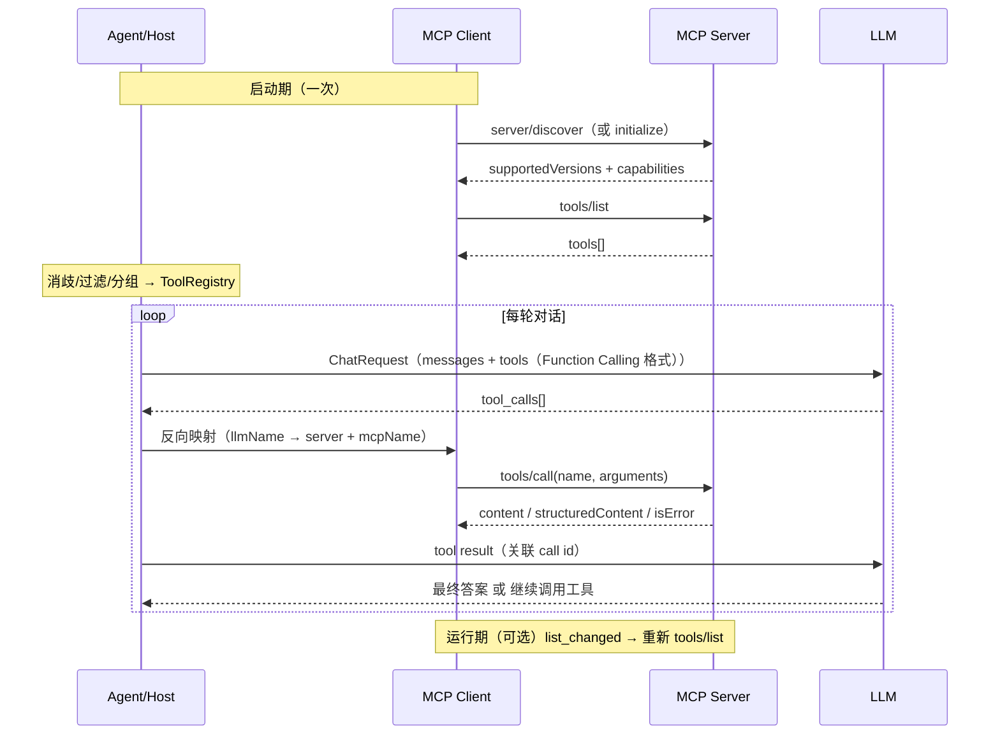

# MCP Protocol Explained: Historical Evolution, Protocol Design, and Client/Server Underlying Principles

> In one sentence: MCP (Model Context Protocol) is an open standard open-sourced by Anthropic at the end of 2024 and now governed by the Agentic AI Foundation under the Linux Foundation. It uses a unified JSON-RPC protocol to decouple "tools/resources/prompts" from every AI application and turn them into pluggable Servers, thereby reducing the integration cost of "AI application × external capability" from M×N to M+N.

{/* truncate */}


<br/>

This article is a special topic on the MCP protocol: it starts from its **origins and version history**, then gradually unfolds **core concepts, protocol design, and Client/Server underlying principles**, and provides **a quick Java-based Client/Server setup** and **a design workflow for integrating with Agents**, finally landing on **security mechanisms, extension governance, and design trade-offs**.

> Official entry points: [specification modelcontextprotocol.io](https://modelcontextprotocol.io) | [official blog](https://blog.modelcontextprotocol.io) | [GitHub organization](https://github.com/modelcontextprotocol) | [official registry](https://registry.modelcontextprotocol.io) | [Java SDK](https://github.com/modelcontextprotocol/java-sdk)

---

## 1. Background and Problem Introduction

### 1.1. Scenario-driven: A Real Integration Challenge

While developing an AI Agent product, we ran into this concrete problem:

> Users want the Agent to check the weather, query a database, read GitHub, send DingTalk messages... and these capabilities have already been written by different teammates using different languages and frameworks as a bunch of "tool services." Some are written in Python, some in Node, and some are simply a shell script.  
> The problem is: **every time a tool is integrated, the Agent application must write adapter code for it**. As tools multiply, the application side becomes a messy stew: one moment it needs to spawn a Python process, another it needs to wrap HTTP, another it needs to write JSON Schema. Switch model vendors, and the Schema format differs again—start over from scratch.

This is not the pain point of a single product, but a pain point of the entire industry. MCP was born precisely for it.

<br/>

### 1.2. The "M × N Integration Disaster" of Function Calling

Before MCP appeared, the mainstream approach was each model vendor's **Function Calling / Tool Use**:

- OpenAI uses `tools[].function.{name,description,parameters}`
- Anthropic uses `tools[].{name,description,input_schema}`
- Each vendor's prompt templates, forced-call parameters, and parallel-call capabilities are not entirely consistent.

This gives rise to a typical **M × N problem**:

```text
M 个 AI 应用（Host / Agent 框架）
        ×
N 个外部工具（DB、GitHub、Slack、文件系统……）
        =
M × N 份适配代码
```

Every time a new tool is added, it must be integrated repeatedly across M applications; every time a new application is added, it must re-integrate with N tools. **Costs grow squarely with scale.**

<br/>

### 1.3. Design Inspiration: An Analogy from LSP

MCP's architectural paradigm is directly inherited from **LSP (Language Server Protocol)**:

```text
LSP：M 个编辑器 × N 种编程语言  →  M + N（协议居中）
MCP：M 个 AI 应用 × N 个外部能力 →  M + N（协议居中）
```

Just as LSP decouples "editors" from "language services" through a unified protocol, MCP decouples "AI applications" from "external capabilities" through a unified protocol. This analogy is the key to understanding all of MCP's design—**Host handles orchestration, Server handles capabilities, and the protocol handles communication**.

<br/>

### 1.4. Questions This Article Answers

1. Where did MCP come from? How has its governance evolved?<br/>
2. What versions does it have? What changed in each version?<br/>
3. What is the full picture of the current (2026-07-28) protocol design?<br/>
4. How does an MCP Client / Server run internally?<br/>
5. What trade-offs lie behind these designs?

---

## 2. Origins and Version History

### 2.1. Release and Open-Sourcing

- **2024-11-05**: The first specification version of MCP was released, defining the client-server architecture, JSON-RPC 2.0, the three major primitives `tools`/`resources`/`prompts`, and two transports: `stdio` and `HTTP+SSE`.
- **2024-11-25**: Anthropic **publicly announced and open-sourced** MCP, releasing Python / TypeScript SDKs and reference Servers for Google Drive, Slack, GitHub, Git, Postgres, etc.

> **Note**: The version number `2024-11-05` predates the public announcement date `2024-11-25`. This is because MCP uses **date-based version numbers**, meaning "**the date of the last backward-incompatible change**", not the release date.

<br/>

### 2.2. Version Numbers and Status Rules

- Version identifiers take the form `YYYY-MM-DD`; the protocol version **does not increment for backward-compatible updates**.
- Each revision has three states: **Draft**, **Current**, and **Final**.
- An individual feature can also be marked **Deprecated**, subject to a formal **feature lifecycle and deprecation policy** (introduced in 2026-07-28, with a deprecation window of at least 12 months).

<br/>

### 2.3. Version Timeline and Adoption Milestones

| Date | Event | Type |
|---|---|---|
| 2024-11-05 | First specification `2024-11-05`: client-server, JSON-RPC 2.0, tools/resources/prompts, stdio + HTTP+SSE | Specification revision |
| 2024-11-25 | Anthropic announces and open-sources MCP, releases Python / TS SDKs and reference Servers | Release |
| 2025-03-19 | Microsoft introduces MCP support in Copilot Studio | Adoption |
| 2025-03-26 | Specification `2025-03-26`: OAuth 2.1 authorization, Streamable HTTP replaces HTTP+SSE, tool annotations, audio, completions, JSON-RPC batching | Specification revision |
| 2025-03-26 | OpenAI introduces MCP in the Agents SDK | Adoption |
| 2025-04-09 | Google Gemini commits to supporting MCP | Adoption |
| 2025-05-19 | Microsoft fully supports MCP at Build 2025; Microsoft and GitHub join the steering committee | Governance/Adoption |
| 2025-05-21 | OpenAI supports remote MCP Servers in the Responses API and joins the steering committee | Adoption/Governance |
| 2025-06-18 | Specification `2025-06-18`: structured tool output, elicitation, resource links; removes JSON-RPC batching; `MCP-Protocol-Version` header | Specification revision |
| 2025-09-05 | Official PHP SDK released | Ecosystem |
| 2025-09-08 | Official MCP Registry preview released | Ecosystem |
| 2025-11-25 | Specification `2025-11-25` (first anniversary): OpenID Connect Discovery, icons, standardized enum elicitation, sampling supporting tool calls, experimental Tasks, JSON Schema 2020-12 | Specification revision |
| 2025-12-09 | Anthropic donates MCP to the newly established Agentic AI Foundation (AAIF) under the Linux Foundation | Governance |
| 2026-01-26 | MCP Apps released as the first official extension | Extension |
| 2026-05-21 | Release Candidate for the next version `2026-07-28` | Specification revision |
| 2026-06-29 | Four Tier 1 SDKs release Beta versions implementing the candidate | Ecosystem |
| 2026-07-28 | Specification `2026-07-28` becomes **Current**; four Tier 1 SDKs support it the same day | Specification revision |

<br/>

### 2.4. Key Design Changes in Each Version

**`2025-03-26`: A Big Leap in Transport and Authorization**

- Adds the **OAuth 2.1** authorization framework;
- Replaces HTTP+SSE with **Streamable HTTP** (at the time sessions were still retained: the `Mcp-Session-Id` header, opening a separate SSE stream via GET, and recovery via `Last-Event-ID`);
- Adds tool annotations, audio content, argument completions, and JSON-RPC batching.

**`2025-06-18`: Structured Output and Security Positioning**

- Adds **structured tool output** (`outputSchema` / `structuredContent`), **elicitation** (the server requesting input from the user), and **resource links** in tool results;
- Clearly positions MCP Server as an **OAuth Resource Server** and requires **Resource Indicators (RFC 8707)**;
- **Removes JSON-RPC batching**;
- Requires subsequent HTTP requests to carry the `MCP-Protocol-Version` header.

**`2025-11-25`: The One-Year Anniversary Version**

- Enhances authorization server discovery to **OpenID Connect Discovery 1.0**, supporting incremental authorization scope consent via `WWW-Authenticate`;
- Tools/resources/templates/prompts support **icon metadata**;
- Elicitation enums are standardized into titled/untitled/single/multi-select and URL modes;
- Sampling supports tool calls; adds the **OAuth Client ID Metadata Documents** registration mechanism;
- Introduces **experimental Tasks**; establishes **JSON Schema 2020-12** as the default dialect.

**`2026-07-28`: The Stateless Paradigm Revision (Current Version)**

Called "the largest revision since release," its highlights: **stateless core, removal of handshake and session, `server/discover`, MRTR, subscription streams, extension framework, authorization hardening, and a formal deprecation policy**. See Chapter 4 for details.

<br/>

### 2.5. Governance

- Starting in 2025, Microsoft, GitHub, OpenAI, and others successively joined the MCP steering committee;
- On 2025-12-09, Anthropic **donated** MCP to the newly established **Agentic AI Foundation (AAIF)** under the Linux Foundation (co-founded by Anthropic, Block, and OpenAI), with an official statement that the governance model remains unchanged;
- The specification adopts the **SEP (Specification Enhancement Proposal)** PR workflow.

---

## 3. Core Concepts

### 3.1. The Three Roles: Host / Client / Server

MCP adopts a **client-host-server** architecture; note there are two "C"s here, which is easy to confuse:

```text
┌──────────────────────────────────────────────────────────┐
│  Host 进程（AI 应用，如 Claude Desktop / IDE / Agent 框架） │
│   ├── Client 1  ──1:1──►  Server 1（本地文件 & Git）       │
│   ├── Client 2  ──1:1──►  Server 2（数据库）               │
│   └── Client 3  ──1:1──►  Server 3（远程 SaaS API）        │
└──────────────────────────────────────────────────────────┘
```

- **Host**: Creates and manages multiple Clients, controls connection permissions and lifecycle, enforces security policies and user authorization decisions, and aggregates context for the LLM.
- **Client**: Created by the Host, **strictly 1:1 with a single Server**; attaches the protocol version and capabilities to each request; routes messages bidirectionally; manages subscriptions and notifications; and maintains security boundaries between Servers.
- **Server**: Exposes concrete capabilities externally through primitives, independent with a single responsibility; can be a local process or a remote service.

> **Key point**: MCP is a **stateless protocol**—each request carries all the information needed for processing (version, capabilities, identity), and the Server must not rely on the connection or previous requests to infer state.

<br/>

### 3.2. The Three Server Primitives and Control

| Primitive | Controlled by | Purpose | Corresponding methods |
|---|---|---|---|
| **Tools** | **model-controlled** | Functions callable by the LLM | `tools/list`, `tools/call` |
| **Resources** | **application-controlled** | Readable context, identified by URI | `resources/list`, `resources/read` |
| **Prompts** | **user-controlled** | Reusable prompt templates | `prompts/list`, `prompts/get` |

Design-wise, the "control" of the three is clearly different: tools are invoked by the model's own decision, resources are injected into context by the application's decision, and prompts are explicitly selected by the user.

<br/>

### 3.3. Four Design Principles

1. **Servers should be extremely easy to build**: complex orchestration is borne by the Host, and the Server focuses on a single capability.
2. **Servers should be highly composable**: multiple Servers can be seamlessly composed, sharing the same protocol.
3. **Servers cannot read the entire conversation, nor can they see other Servers**: the full conversation history stays only in the Host; Servers are isolated from each other, and cross-Server interaction is controlled by the Host.
4. **Features can be added incrementally**: the core protocol is minimal, and other capabilities are declared and negotiated on demand.

<br/>

### 3.4. Capability Negotiation

Capability negotiation is a core mechanism of MCP, but **the negotiation method underwent a fundamental change in 2026-07-28**:

- **Old model (≤ 2025-11-25)**: through the `initialize` handshake, capabilities for the entire session are exchanged and determined in one go.
- **New model (2026-07-28)**: no handshake; the client declares capabilities in `_meta.io.modelcontextprotocol/clientCapabilities` on **each request**; the server announces its supported versions and capabilities in one shot via [`server/discover`](https://modelcontextprotocol.io/specification/2026-07-28/server/discover).

Typical capabilities: server `tools` / `resources` / `prompts` / `logging` / `completions`; client `roots` / `sampling` / `elicitation`.

> **Important rule**: A server **MUST NOT** rely on capabilities not declared by the client; if handling a request requires a capability the client has not declared, the server **MUST** return `-32021 MissingRequiredClientCapability` and list them in `data.requiredCapabilities`.

---

## 4. Core Protocol Design

### 4.1. Message Model: JSON-RPC 2.0

All MCP messages follow **JSON-RPC 2.0**, and messages **MUST** be UTF-8. Message types:

```jsonc
// 1) Request：请求，MUST 带非 null 的 id（不得与未响应的请求 id 重复）
{ "jsonrpc": "2.0", "id": 1, "method": "tools/call", "params": { /* ... */ } }

// 2) Result Response：成功响应，MUST 带 resultType（2026-07-28 起）
{ "jsonrpc": "2.0", "id": 1, "result": { "resultType": "complete", "content": [ /* ... */ ] } }

// 3) Error Response：失败响应，MUST 带 code 与 message
{ "jsonrpc": "2.0", "id": 1, "error": { "code": -32602, "message": "Invalid params" } }

// 4) Notification：通知，MUST NOT 带 id
{ "jsonrpc": "2.0", "method": "notifications/tools/list_changed" }
```

> **Design point**: MCP specifies that "**the client only sends requests/notifications, and the server only sends responses/notifications**"—the server does not proactively send requests (after 2026-07-28), and the client does not send responses. This constraint is the cornerstone of the stateless and unidirectional-flow design.

<br/>

### 4.2. `_meta`: Request-Level Protocol Metadata

All protocol metadata is carried with the **message body** (the transport layer may optionally mirror it into envelope headers). The `_meta` fields of a client request:

| Key | Type | Required | Description |
|---|---|---|---|
| `io.modelcontextprotocol/protocolVersion` | string | Yes | The protocol version used for this request |
| `io.modelcontextprotocol/clientCapabilities` | object | Yes | Client-related capabilities |
| `io.modelcontextprotocol/clientInfo` | object | No | Client name and version (SHOULD) |
| `io.modelcontextprotocol/logLevel` | string | No | Minimum log level for this request |

The server **SHOULD** return `io.modelcontextprotocol/serverInfo` in the `_meta` of every result. In addition, `traceparent` / `tracestate` / `baggage` are reserved for OpenTelemetry tracing context.

> **Key point**: The absence of `protocolVersion` and `clientCapabilities` constitutes a **malformed request**, and the server **MUST** reject it with `-32602` (returning `400 Bad Request` over HTTP). This is the concrete embodiment of "requests are self-describing and do not depend on connection state."

<br/>

### 4.3. `resultType`: Polymorphic Result Design

2026-07-28 introduces a **required** `resultType` for all results:

- `"complete"`: normal completion, with `result` containing the final content;
- `"input_required"`: the client needs to supply additional input (see 4.8 MRTR);
- Extensions may add other `resultType` values, but they must come from the core set or a declared extension;
- If a client encounters an unrecognized `resultType`, it **MUST** treat it as invalid;
- For older servers that do not return `resultType`, the client **MUST** treat it as `"complete"`.

<br/>

### 4.4. Error Model and Error Codes

MCP divides errors into two categories, **handled differently**:

| Type | Meaning | Returned via | Model can self-correct |
|---|---|---|---|
| **Protocol Error** | Request structure problems (unknown tool, malformed request, server error) | JSON-RPC `error` object | Usually can't |
| **Tool Execution Error** | Business/API/validation errors | `result.isError = true` + text | **Can** |

Error code partition strategy:

- `-32700`, `-32600`~`-32603`: standard JSON-RPC generic errors;
- `-32000`~`-32019`: **legacy** implementation-defined range (new implementations should no longer allocate from it);
- `-32020`~`-32099`: **reserved for the MCP specification** (see [Schema error definitions](https://modelcontextprotocol.io/specification/2026-07-28/schema)). Defined in 2026-07-28:

| Code | Name |
|---|---|
| `-32020` | `HeaderMismatch` |
| `-32021` | `MissingRequiredClientCapability` |
| `-32022` | `UnsupportedProtocolVersion` |

The historical code `-32002` (resource not found, ≤2025-11-25) was replaced by `-32602`, but clients **SHOULD** still remain compatible with older servers' `-32002`.

<br/>

### 4.5. Transport Design

Protocol semantics are consistent across all transports; transports are only responsible for "framing, delivery, cancellation, and termination." There are two standard transports:

**stdio** ([spec](https://modelcontextprotocol.io/specification/2026-07-28/basic/transports/stdio))

- The Client starts the Server as a subprocess and communicates through its standard streams;
- Each message is one line of JSON, **with no embedded newlines**;
- The Server **MUST NOT** write non-MCP messages to `stdout`; logs go to `stderr`;
- Cancellation: send `notifications/cancelled` (single channel, no per-request stream);
- Shutdown: close stdin → wait for exit → `SIGTERM` → `SIGKILL` (on Windows use `TerminateProcess`/Job Objects).

**Streamable HTTP (2026-07-28 form)** ([spec](https://modelcontextprotocol.io/specification/2026-07-28/basic/transports/streamable-http))

- A single **MCP endpoint**, **POST** only; each request is an independent POST;
- Request headers MUST include `Accept: application/json, text/event-stream`, `MCP-Protocol-Version`, `Mcp-Method`, and for `tools/call`/`resources/read`/`prompts/get` also `Mcp-Name`;
- The response can be a single JSON, or a **request-level SSE stream** (notifications first, with the final response last);
- Cancellation = closing the response stream for that request;
- 2026-07-28 **removes**: the HTTP GET stream, `Mcp-Session-Id`, and `Last-Event-ID` recoverability.

```http
POST /mcp HTTP/1.1
Content-Type: application/json
Accept: application/json, text/event-stream
MCP-Protocol-Version: 2026-07-28
Mcp-Method: tools/call
Mcp-Name: get_weather

{ "jsonrpc": "2.0", "id": 1, "method": "tools/call",
  "params": { "name": "get_weather", "arguments": { "location": "Seattle, WA" },
    "_meta": { "io.modelcontextprotocol/protocolVersion": "2026-07-28",
               "io.modelcontextprotocol/clientCapabilities": {} } } }
```

> **Deprecation note**: The old HTTP+SSE (2024-11-05) was replaced on 2025-03-26 and officially classified as **Deprecated** in 2026-07-28; new implementations should not adopt it.
>
> **Note**: `x-mcp-header` allows mirroring primitive-typed parameters (string/integer/boolean, not number) into `Mcp-Param-{Name}` headers to facilitate gateway routing; however, headers are visible to the intermediate network, and **must not** be marked with passwords/Tokens/PII.

<br/>

### 4.6. Lifecycle: legacy Handshake vs. modern Per-Request

**Legacy (≤ 2025-11-25)**:

```text
initialize → 服务端返回能力 → notifications/initialized → 正常操作 → 关闭
```

`initialize` request/response structure:

```json
// 请求
{ "jsonrpc": "2.0", "id": 1, "method": "initialize",
  "params": { "protocolVersion": "2025-06-18",
              "capabilities": { "roots": { "listChanged": true }, "sampling": {} },
              "clientInfo": { "name": "ExampleClient", "version": "1.0.0" } } }

// 响应
{ "jsonrpc": "2.0", "id": 1,
  "result": { "protocolVersion": "2025-06-18",
              "capabilities": { "tools": { "listChanged": true } },
              "serverInfo": { "name": "ExampleServer", "version": "1.0.0" } } }
```

**Modern (2026-07-28)**: no handshake; version and capabilities are carried in the `_meta` of each request; `server/discover` is optional and is used to obtain the version/capabilities/identity in one go.

**Dual-era compatibility** is a real necessity (old and new Servers coexist), and the official detection mechanism is given:

- stdio: first send `server/discover`; success → modern; a non-modern error or timeout → fall back to `initialize`;
- HTTP: first send a modern request; on `400`, inspect the response body first—if it is a recognizable modern error → modern; otherwise fall back to `initialize`.

> **Note**: Era determination is a **server property** and should be cached (by process for stdio, by origin for HTTP) to avoid probing on every request.

<br/>

### 4.7. Stateless Design (Core of 2026-07-28)

| Change | Description |
|---|---|
| Removes session and `Mcp-Session-Id` | Requests can be handled by any Server instance, suitable for stateless deployment |
| Removes the `initialize`/`initialized` handshake | Version and capabilities move to per-request `_meta` |
| Adds `server/discover` | Announces supportedVersions / capabilities / identity in one go |
| List endpoints no longer vary by connection | `tools/list` does not vary by connection, but can vary by authorization credentials |

The direct requirement of statelessness: **state across calls** must be explicitly returned by the Server as a handle (such as `basket_id`), and passed back by the client as an ordinary argument in subsequent calls. The protocol itself has no concept of a "state handle"—from the wire's perspective, it is just an ordinary string.

<br/>

### 4.8. MRTR: Multi Round-Trip Requests

The old version allowed the Server to **proactively** send requests (`sampling/createMessage`, `elicitation/create`, `roots/list`) through the SSE stream. 2026-07-28 changes this to:

- The Server returns an `InputRequiredResult` (`resultType: "input_required"`) in the response, with the `inputRequests` field describing the required input;
- After the client fills it in, it replays the original request with a **new id** and carries back the answers in `params.inputResponses` (optionally passing through server state via `requestState`).

```text
Client ── tools/call(id:1) ──► Server
Client ◄─ InputRequiredResult（inputRequests: elicitation/create）── Server
Client ── tools/call(id:2, 原参数 + inputResponses) ──► Server
Client ◄─ 最终 result ── Server
```

> **Key point**: MRTR ([Multi Round-Trip Requests](https://modelcontextprotocol.io/specification/2026-07-28/basic/patterns/mrtr), SEP-2322) transforms "server reverse requests" into "client-initiated retries," making it consistent with the stateless model.

<br/>

### 4.9. Subscriptions and Notifications

2026-07-28 replaces the old GET stream and `resources/subscribe` with a **long-lived POST response stream** [`subscriptions/listen`](https://modelcontextprotocol.io/specification/2026-07-28/basic/patterns/subscriptions):

- The Client declares the subscription types (`toolsListChanged`, `promptsListChanged`, `resourcesListChanged`, `resourceSubscriptions`);
- The Server first returns `notifications/subscriptions/acknowledged`, then pushes change notifications on that stream;
- Each notification carries `_meta.io.modelcontextprotocol/subscriptionId` to associate it with the originating subscription.

> **Note**: Request-level notifications (`notifications/progress`, `notifications/message`) only travel on **the request's own response stream**. In addition, 2026-07-28 removes SSE recoverability, so a broken stream means the request is lost.

<br/>

### 4.10. Listing and Caching

- [`tools/list`](https://modelcontextprotocol.io/specification/2026-07-28/server/tools), `prompts/list`, `resources/list`, etc. support **pagination** (`cursor` / `nextCursor`) and **caching**;
- 2026-07-28 requires list/read results to carry `ttlMs` (freshness hint) and `cacheScope` (`public`/`private`, controlling whether shared intermediaries can cache);
- The Server **SHOULD** sort stably to facilitate client caching and LLM Prompt Cache hits;
- Tool definitions include `name`, `title`, `description`, `inputSchema` (default JSON Schema 2020-12), optional `outputSchema`, `icons`, `annotations`.

**Tool definition and invocation example:**

```json
// tools/list → tools[]
{ "name": "get_weather",
  "title": "Weather Information Provider",
  "description": "Get current weather information for a location",
  "inputSchema": { "type": "object",
    "properties": { "location": { "type": "string", "description": "City name or zip code" } },
    "required": ["location"] },
  "outputSchema": { "type": "object", "properties": { "temperature": { "type": "number" } } } }
```

```json
// tools/call 成功响应（非结构化文本 + 结构化内容并存）
{ "jsonrpc": "2.0", "id": 2, "result": {
  "resultType": "complete",
  "content": [{ "type": "text", "text": "{\"temperature\": 22.5, \"conditions\": \"Partly cloudy\"}" }],
  "structuredContent": { "temperature": 22.5, "conditions": "Partly cloudy" },
  "isError": false
}}
```

> **Note**: Tool names are 1~128 characters, case-sensitive, allow only `A-Za-z0-9_-` and `.`, and are **unique within a single Server**; `inputSchema` **MUST** be a valid JSON Schema (cannot be `null`); for tools with no parameters, `{ "type": "object", "additionalProperties": false }` is recommended.

---

## 5. Underlying Principles of a Core MCP Client / Server

> **This section answers**: Setting aside frameworks, how exactly does an MCP client/server run internally?

### 5.1. Message Encoding/Decoding and Request Correlation

Whether stdio or HTTP, the client core is a routing table of **`id → pending Future`**:

```text
发送请求：  id = nextId++; pending.put(id, future);  transport.send(jsonRpcRequest)
收到消息：  if 有 id 且 有 result/error  → pending.remove(id).complete(...)
           if 无 id 且 method=notifications/* → 交给通知分发器
```

Taking LangChain4j as an example, `McpOperationHandler` internally is a `Map<Long, CompletableFuture<JsonNode>>`: when it receives a message "with an id and with result/error," it completes the corresponding Future; when it receives a `ping` request, it replies with `McpPingResponse`; when it receives `notifications/message`, it forwards it to the log consumer.

> **Key point**: The protocol is **asynchronous request-response**, but actual usage usually exposes synchronous methods (`CompletableFuture.get()` or blocking wait), so "timeouts" must be enforced on the client side—this is explicitly recommended by the MCP specification.

<br/>

### 5.2. Client Layering

```text
┌──────────────────────────────────────────────┐
│  Client / Protocol 层                          │
│  版本协商、能力声明、id→Future 路由、超时       │
├──────────────────────────────────────────────┤
│  Transport 层（stdio / Streamable HTTP）       │
│  消息分帧、收发、取消、关闭                     │
└──────────────────────────────────────────────┘
```

Key points: the choice of sync/async, timeouts and cancellation, dual-era detection and caching, subprocess restart and request retry.

<br/>

### 5.3. Transport Implementation Breakdown

**stdio:** Use `ProcessBuilder` to start a subprocess, with two background threads reading `stdout` / writing `stdin` respectively; messages are framed line by line; `stderr` is for logs only; when the process exits, the upper layer can restart and retry lost requests.

**Streamable HTTP:** Based on an ordinary HTTP client, POST to a single endpoint; based on the response `Content-Type`, decide between "reading JSON directly" and "reading the SSE stream entry by entry, with the last entry being the final response"; cancellation means closing the response stream.

<br/>

### 5.4. Server: `tools/list` and `tools/call`

What the server needs to do: parse JSON-RPC → dispatch by `method` → call the business implementation → encapsulate the standard response/error. Key points:

- Declare capabilities: `{ "capabilities": { "tools": { "listChanged": true } } }` (in the old version in the `initialize` result, in the new version in the `server/discover` result);
- `tools/list` returns tool definitions (supporting pagination/caching, stable sorting);
- `tools/call` executes and returns `content` / `structuredContent` / `isError`;
- Strictly distinguish "protocol errors (JSON-RPC error)" from "tool execution errors (`isError=true`)".

<br/>

### 5.5. Hierarchical Structure of Reference Implementations

**LangChain4j (Java):**

```text
McpToolProvider (ToolProvider)
      │  聚合 1..N 个 McpClient，过滤/改名
DefaultMcpClient (McpClient)
      │  管理 JSON-RPC 生命周期（initialize、listTools、callTool）
McpTransport（Stdio / StreamableHttp / WebSocket / Docker）
      │  只负责消息收发
```

- `McpToolExecutor` implements the framework's `ToolExecutor`, internally calling `McpClient.executeTool(...)`;
- `ToolSpecificationHelper` handles the conversion between MCP `inputSchema` ↔ the framework's `ToolSpecification` (supporting object/array/enum/anyOf).

**Spring AI (Java):**

- `SyncMcpToolCallback(client, tool)` / `AsyncMcpToolCallback` adapt MCP tools into `ToolCallback`;
- `SyncMcpToolCallbackProvider` aggregates tools from multiple `McpSyncClient`s.

<br/>

### 5.6. Comparison of Mainstream "Integration Patterns"

**Approach A: Framework-side tool adapter (Adapter / Provider)—mainstream**

Implement an adaptation layer of "MCP tool → framework tool" in the client SDK (i.e., the pattern in 5.5).

- Pros: low integration cost, dynamic discovery, reusing the same loop as the framework's tool system;
- Cons: requires the framework side to implement a protocol client and Schema mapping.

**Approach B: MCP gateway / registry aggregation—platformization**

Use a gateway (such as AWS Bedrock AgentCore Gateway) or a registry (MCP Registry) to aggregate multiple MCP Servers into a unified entry point.

- Pros: centralized governance, authentication, rate limiting, observability;
- Cons: introduces gateway operation-and-maintenance costs; adds one more network hop.

**Approach C: Dynamically materializing into local tools—a shortcut**

At runtime, pull `tools/list` and disguise MCP tools as local methods using dynamic proxies or code generation.

- Pros: transparent to the upper layer;
- Cons: hard to carry complex JSON Schema parameters; debugging is not intuitive; not recommended for long-term use.

**Approach D: Upgrading the MCP Server into an independent Runtime / SubAgent**

Treat the Server as an independent Agent runtime, which the main Agent calls in a "task delegation" manner (similar to A2A).

- Pros: suitable for complex, stateful, long-running tasks;
- Cons: heavyweight, deviating from MCP's original intent of a "simple Server."

> **Conclusion**: For the vast majority of scenarios, choose **Approach A**, which is the highest return-on-investment route.

<br/>

### 5.7. Quickly Building an MCP Client / Server in Java

> With the official **MCP Java SDK** (`io.modelcontextprotocol.sdk`), you can get a Client/Server running in a few dozen lines. Key points: the SDK requires **JDK 17+**; the core module `mcp` has built-in **STDIO / Streamable HTTP / SSE(legacy)** transports; the client defaults to the JDK `HttpClient`, and JSON defaults to Jackson; the server core has built-in Servlet transports; it provides both synchronous and asynchronous APIs (asynchronous based on Reactor).

**1) Add the dependency**

```xml
<dependencyManagement>
  <dependencies>
    <dependency>
      <groupId>io.modelcontextprotocol.sdk</groupId>
      <artifactId>mcp-bom</artifactId>
      <version>2.0.1</version>
      <type>pom</type>
      <scope>import</scope>
    </dependency>
  </dependencies>
</dependencyManagement>

<dependency>
  <groupId>io.modelcontextprotocol.sdk</groupId>
  <artifactId>mcp</artifactId>
</dependency>
```

**2) Client: connect to a local stdio Server and call a tool**

```java
// 1. 传输：启动本地子进程（例如官方 everything server）
ServerParameters params = ServerParameters.builder("npx")
        .args("-y", "@modelcontextprotocol/server-everything", "dir")
        .build();
McpTransport transport = new StdioClientTransport(params, McpJsonDefaults.getMapper());

// 2. 同步客户端 + 能力 + 超时
McpSyncClient client = McpClient.sync(transport)
        .requestTimeout(Duration.ofSeconds(10))
        .capabilities(ClientCapabilities.builder()
                .roots(true).sampling().elicitation().build())
        .build();

// 3. 初始化（完成版本/能力协商）
InitializeResult init = client.initialize();
String version = init.protocolVersion();

// 4. 发现工具 + 调用工具
ListToolsResult tools = client.listTools();
CallToolResult result = client.callTool(CallToolRequest.builder("calculator")
        .arguments(Map.of("operation", "add", "a", 2, "b", 3))
        .build());

// 5. 优雅关闭
client.closeGracefully();
```

Connecting to a remote Server requires only switching the transport (Streamable HTTP):

```java
McpTransport transport = HttpClientStreamableHttpTransport
        .builder("http://your-mcp-server")
        .endpoint("/mcp")
        .build();
```

> **Note**: `listTools()` / `listResources()` / `listPrompts()` all support pagination; you need to loop until `nextCursor == null` to obtain the full set of tools.

**3) Server: expose a tool**

```java
StdioServerTransportProvider transportProvider =
        new StdioServerTransportProvider(McpJsonDefaults.getMapper());

McpSyncServer server = McpServer.sync(transportProvider)
        .serverInfo("my-server", "1.0.0")
        .capabilities(ServerCapabilities.builder().tools(true).build())
        .build();

var calculator = SyncToolSpecification.builder()
        .tool(Tool.builder("calculator", inputSchema)
                .description("Basic calculator")
                .build())
        .callHandler((exchange, request) -> {
            int a = (int) request.arguments().get("a");
            int b = (int) request.arguments().get("b");
            return CallToolResult.builder()
                    .content(List.of(new McpSchema.TextContent("Result: " + (a + b))))
                    .build();
        })
        .build();

server.addTool(calculator);
```

When exposing it as a remote HTTP service, switch the transport to the core built-in `HttpServletStreamableServerTransportProvider` (or the Spring WebMVC / WebFlux provider) and register the MCP endpoint at `/mcp`.

**4) Java comparison of the three transports**

| Transport | Client class | Server class | Remarks |
|---|---|---|---|
| STDIO | `StdioClientTransport` | `StdioServerTransportProvider` | Local subprocess |
| Streamable HTTP | `HttpClientStreamableHttpTransport` | `HttpServletStreamableServerTransportProvider` | Remote; Spring also has WebMVC/WebFlux |
| SSE (legacy) | `HttpClientSseClientTransport` | `HttpServletSseServerTransportProvider` | Deprecated, only for compatibility with older Servers |

**5) Higher-level one-click solutions**

- **Spring AI**: Boot Starter + `@McpTool` / `@McpToolParam` annotations + `SyncMcpToolCallback`, adapting MCP tools directly into Spring tool callbacks.
- **AgentScope Java**: `McpClientBuilder` + `Toolkit.registerMcpClient(...)`, see Chapter 6.

<br/>

### 5.8. Choosing an Implementation in the Java Ecosystem

| Solution | Positioning | Connection | Tool adaptation | Suitable for |
|---|---|---|---|---|
| **Official MCP Java SDK** | Protocol-layer reference implementation | `McpClient` / `McpServer` | Adapt yourself | Full control over protocol details |
| **Spring AI** | Spring ecosystem integration | `McpSyncClient` / Starter | `SyncMcpToolCallback` / `@McpTool` | Spring Boot applications |
| **LangChain4j** | LLM application framework | `McpTransport` + `DefaultMcpClient` | `McpToolExecutor` / `McpToolProvider` | AI Services already using LangChain4j |
| **AgentScope Java** | Multi-Agent framework | `McpClientBuilder` | `Toolkit.registerMcpClient` | Multi-Agent orchestration, tool governance needed |

> **Key point**: When choosing, don't look at "who is more complete," but at "which ecosystem your Agent runs in." Protocol behavior is guaranteed by the SDK; the differences lie mainly in tool governance, annotation experience, and orchestration capability.

---

## 6. MCP Design Workflow for Integrating with an Agent

> **This section answers**: When integrating one or more MCP Servers into an Agent, what workflow should be followed? Referring to the **AgentScope (Java)** implementation, it can be summarized as six steps: "Connect → Discover → Map → Execute → Lifecycle → Security."

### 6.1. Overall Workflow

```text
① 连接 Connect       选传输、建 Client、初始化/能力协商、超时
        ↓
② 发现 Discover      tools/list（分页）→ 工具清单
        ↓
③ 映射 Map           MCP Tool → Agent 工具定义（inputSchema 透传 + 命名空间消歧）
        ↓
④ 执行 Execute       Agent 工具循环 → tools/call → content/isError → 回填
        ↓
⑤ 生命周期 Lifecycle listChanged/subscriptions、连接复用、关闭/重启
        ↓
⑥ 安全 Governance     审批、白名单、Tool Poisoning、凭据
```

### 6.2. Two Key Timings: Pull During Discovery vs. Call During Execution

> **Core conclusion**: `tools/list` (pulling tools) happens during **Agent startup / registration**, before entering the main loop; `tools/call` (invoking tools) happens during the **Act phase of each ReAct round**, after the model selects a tool. The two have different timings and frequencies.

```text
【启动 / 注册期 · 通常只做一次】
  connect → initialize / server.discover（版本 + 能力协商）
     └─ tools/list ──► 消歧 · 过滤 · 分组 ──► 注册进 Agent 的“工具表”（缓存）
                        （此表即后续每轮提供给模型的工具声明）

【每次 run · 每轮对话循环】
  loop {
    Think：组装请求（把缓存的工具声明序列化进 LLM 的 tools[]）→ 调 LLM
             ├─ 模型未选工具 → 结束本轮
             └─ 模型返回 tool_call(s)
    Act：  按 name 查“工具表” → tools/call ──► MCP Server 执行
             └─ content / structuredContent / isError 写回 memory → 回到 Think
  }

【运行期 · 可选】
  notifications/tools/list_changed / subscriptions/listen
     └─ 重新 tools/list → 刷新工具表（一般安排在轮次之间，避免打断推理）
```

**A few easily confused points:**

1. **`tools/list` is not sent every round**: after discovering once, it is cached; each round's model request uses this cache and does not repeatedly call the protocol.
2. **"Giving tool declarations to the model" ≠ `tools/list`**: the Think phase merely serializes the cached declarations into the `tools[]` field of the LLM request, which is local data assembly.
3. **`tools/call` only happens when the model selects a tool**: a single response may contain 0, 1, or multiple tool_calls; the Act phase executes them one by one (or in parallel).
4. **Refresh timing**: re-discovery is required only when the server declares `listChanged` (or subscribes via `subscriptions/listen`); refresh is scheduled between rounds to avoid changing the tool set mid-way and causing model context inconsistency.
5. **Lazy discovery variant**: a few frameworks pull only on first session / first use, or lazily activate subsets by group; but the skeleton of "discover first, execute later" remains unchanged.

**Timing reference table:**

| Action | Timing | Frequency | Trigger |
|---|---|---|---|
| `connect` / `initialize` | Agent startup | Once | Agent initialization |
| `tools/list` (pull) | Registration (before the loop) | Once; re-pull on `listChanged` | Agent initialization / change notification |
| Tool declarations into the LLM request | Each Think round | Every round | Every model call |
| `tools/call` (invoke) | Each Act round | When there is a tool_call | Model selection + tool loop |
| `close` | Agent destruction | Once | Lifecycle management |

### 6.3. Step One: Connect

- **Choose a transport**: use stdio (subprocess) for local tools, Streamable HTTP for remote, and SSE only for backward compatibility with older servers.
- **Create a Client**: declare capabilities (roots / sampling / elicitation), set request timeout and initialization timeout.
- **Version compatibility**: the new specification uses per-request `_meta`; when compatible with older servers, perform dual-era detection (see 4.6). AgentScope explicitly declares supported versions via `protocolVersions(...)`:

```java
McpClientWrapper client = McpClientBuilder.create("filesystem-mcp")
        .stdioTransport("npx", "-y", "@modelcontextprotocol/server-filesystem", "/tmp")
        .timeout(Duration.ofSeconds(120))
        .initializationTimeout(Duration.ofSeconds(30))
        .protocolVersions("2024-11-05", "2025-03-26", "2025-06-18")
        .buildAsync().block();
```

> **Note**: AgentScope declares only `2024-11-05` by default; to connect to a newer Server you must explicitly call `protocolVersions(...)`, otherwise it reports "Unsupported protocol version". For the HTTP transport you can additionally add `.header("Authorization", "Bearer ...")` to inject credentials.

### 6.4. Step Two: Tool Discovery

- Use `tools/list` to pull the full set (**pagination loop**); when the server declares `listChanged`, you can subscribe to changes.
- **Namespace disambiguation**: AgentScope uses `mcp__{server_name}__{tool_name}` to avoid duplicate names across multiple Servers (for example, two Servers both have `search`).
- **Filtering**: allowlist / denylist (`enableTools` / `disableTools`) for minimal exposure.
- **Grouping**: group by Server or purpose and activate on demand (tool groups) to reduce the number of tools pushed to the model at once.

```java
Toolkit toolkit = new Toolkit();
toolkit.registerMcpClient(mcpClient).block();                 // 全量注册
// 或过滤 + 分组
toolkit.registration().mcpClient(mcpClient)
        .enableTools(List.of("read_file", "list_directory"))
        .disableTools(List.of("delete_file"))
        .group("filesystem").apply();
```

### 6.5. Step Three: Mapping to Agent Tools—Essentially Converting to the Function Calling Protocol

> **Core conclusion**: The essence of integrating MCP tools into an Agent is a **protocol conversion**—converting the tools pulled by MCP `tools/list` into the current model Provider's **Function Calling protocol** (OpenAI's `tools[].function` / Anthropic's `tools[]`), delivered to the model for selection with each LLM request; after the model returns a `tool_call`, it is **reverse-mapped** back to MCP `tools/call`. In one sentence: **MCP governs "source and execution," while Function Calling governs "presentation and selection."**

```text
MCP Server ──tools/list──► 工具清单 Tool{name, description, inputSchema}
                                 │  适配层：MCP → Function Calling
                                 ▼
                   模型 Function-Calling schema
                   （OpenAI tools[].function / Anthropic tools[]）
                                 │  随每次 LLM 请求下发
                                 ▼
                          LLM 选择 → tool_call
                                 │  适配层：反向解析 name + arguments
                                 ▼
MCP Server ◄──tools/call── 原始工具名 + arguments
                                 │
                    CallToolResult ──► tool result 消息 ──► 回灌 LLM
```

**Forward mapping (MCP Tool → Function Calling):**

| MCP Tool (source) | OpenAI | Anthropic |
|---|---|---|
| `name` | `function.name` | `name` |
| `description` | `function.description` | `description` |
| `inputSchema` (JSON Schema 2020-12) | `function.parameters` | `input_schema` |
| `outputSchema` | Generally ignored (or used for strict) | Ignored |
| `annotations` / `icons` | Partially mapped | Partially mapped |

> `inputSchema` is itself JSON Schema and can almost be passed through directly as `parameters` / `input_schema`—this is the key reason MCP and Function Calling can be integrated at low cost.

**Reverse mapping (model tool_call → MCP `tools/call`):**

| Model return | Handling |
|---|---|
| `name` | Strip the disambiguation prefix → restore to the original MCP tool name |
| `arguments` (OpenAI is a JSON **string**; Anthropic `input` is an **object**) | Normalize into a Map → `arguments` of `tools/call` |
| `id` / `tool_use_id` | Retained to associate the result back to that call |

**Result backfill (MCP CallToolResult → model tool result):**

| MCP return | Converted to |
|---|---|
| `content[]` (text / image / audio / resource) | The content of the ToolMessage / `tool_result` block |
| `structuredContent` | The structured output pipeline (or serialized into text) |
| `isError = true` | Mark the tool result as an error and hand it to the model for self-correction |

**A few pitfalls:**

1. **This is a format conversion, not protocol translation**: each vendor's Function Calling field names differ, and `inputSchema → parameters / input_schema` is handled by the Provider Adapter.
2. **Every LLM request must carry tool declarations** (the Chat API is stateless), but `tools/list` is pulled only once and cached—don't confuse the two.
3. **Names must be disambiguated**: after aggregation across multiple Servers, the `name` seen by the model may differ from the original MCP `name`, so a mapping table must be maintained.
4. **arguments forms vary**: OpenAI uses a JSON string while Anthropic uses an object; normalize during mapping.
5. **MCP is not responsible for "the model selecting tools"**: selection relies on the model's Function Calling capability; MCP only guarantees "unified tool definitions + unified execution."

### 6.6. Step Four: Execution and Backfill (Execute)

- After the Agent's ReAct/Tool loop selects a tool → issue `tools/call(name, arguments)`.
- Result handling has three branches:
  - `content` (text / image / audio / resource) → concatenate into text and feed back to the model;
  - `structuredContent` → pass through to pipelines that support structured output;
  - `isError = true` → return to the model as a "**tool execution error**" for self-correction (**do not** throw an exception to interrupt the conversation);
  - JSON-RPC `error` (**protocol error**) → go through the framework's error handling pipeline.

```text
Agent tool loop
   │ 选中工具 github__search_repos
   ▼
MCP callTool("search_repos", args)
   ▼
result.content / structuredContent / isError
   ▼
回填对话，模型继续下一轮
```

### 6.7. Step Five: Lifecycle and Hot Updates (Lifecycle)

- **Connection reuse**: one Client's long connection serves the entire Agent lifecycle.
- **Hot updates**: `notifications/tools/list_changed` → re-`tools/list`; 2026-07-28 uses `subscriptions/listen` to subscribe to changes.
- **Shutdown**: stdio closes stdin → waits → force kills; HTTP closes the connection.
- **Fault tolerance**: stdio subprocess crashes are automatically restarted and requests retried; HTTP timeouts are retried.

### 6.8. Step Six: Security and Governance

- **Human-in-the-loop**: approval before sensitive tool invocations (AgentScope has a Permission / Hook system; other frameworks can implement it with middleware).
- **Minimal exposure**: register only the necessary tools (allowlist first).
- **Tool Poisoning**: treat tool descriptions and annotations as untrusted input at all times.
- **Credentials**: the HTTP transport uses OAuth / API Key (`header(...)`); stdio uses environment variables.

### 6.9. Reference Implementation Comparison

| Framework | Connection | Discovery / Registration | Execution adaptation | Features |
|---|---|---|---|---|
| **AgentScope Java** | `McpClientBuilder` (StdIO / SSE / StreamableHTTP) | `Toolkit.registerMcpClient` | Unified Toolkit tool table | Tool filtering / grouping, Higress gateway semantic retrieval, elicitation callbacks |
| **LangChain4j** | `McpTransport` + `DefaultMcpClient` | `McpToolProvider` | `McpToolExecutor` | Aligned with AiServices / ToolProvider |
| **Spring AI** | `McpSyncClient` / `McpAsyncClient` | `SyncMcpToolCallbackProvider` | `SyncMcpToolCallback` | Boot Starter, `@McpTool` annotations, Security integration |

> **Key point**: No matter which framework is used, the skeleton for an Agent to integrate MCP is the same—"**Client connects → tools/list discovers → tool adaptation → tools/call executes → lifecycle and security governance**." The difference lies only in API form and governance capability.

### 6.10. The Complete Underlying Call Process (Frame-by-Frame)

> This section breaks down "MCP integration into an Agent" to the **protocol frame level**: from the Agent starting the connection, to tool discovery, format conversion, model selection, tool execution, result backfill, loop convergence, refresh, and shutdown, each step gives the real JSON / invocation fragments. The examples uniformly use: Server alias `weather`, MCP original tool name `get_weather`, tool name exposed to the model `weather__get_weather`.

**Panoramic sequence (one complete run):**

```text
[启动期]
  0. 装配 MCP Client（传输 + 能力 + 超时）
  1. 建立连接（stdio 起子进程 / HTTP 建连接）
  2. 初始化：server/discover（现代）或 initialize（传统）
  3. tools/list（分页拉全量）
  4. 消歧/过滤/分组 → 写入 ToolRegistry，并建映射表
        llmName(weather__get_weather) ⇄ (server=weather, mcpName=get_weather, executor)

[每次 run]
  loop {
    5. Think：组装 ChatRequest（tools = 缓存的声明转 provider 格式）→ 调 LLM
    6. LLM 返回：text 或 tool_calls[]
    7. 若有 tool_calls → Act：
         a. 用 llmName 查映射表得到 (mcpName, executor)
         b. arguments 归一化成 Map
         c. before-tool 中间件（审批/日志）
         d. executor → tools/call（JSON-RPC）→ MCP Server 执行
         e. result(content/structuredContent/isError) → tool result 消息（关联 call id）
         f. after-tool 中间件
         g. 写回 memory
    8. 回到 5（带 tool results）
    9. LLM 不再返回 tool_calls → 输出最终答案 → run 结束
  }

[运行期]    10. list_changed / subscriptions → 重新 tools/list → 刷新注册表
[销毁期]    11. close：stdio 关 stdin→等待→强杀；HTTP 关闭连接
```

<br/>

**Frame 0-1: Assembly and connection**

- Choose transport: stdio for local (`ProcessBuilder` starts a subprocess), Streamable HTTP for remote.
- Assemble the Client: declare capabilities (roots / sampling / elicitation), request timeout, initialization timeout.

<br/>

**Frame 2: Initialization (modern `server/discover`)**

```json
// → 请求（stdio：一整行 JSON）
{
  "jsonrpc": "2.0",
  "id": "discover-1",
  "method": "server/discover",
  "params": {
    "_meta": {
      "io.modelcontextprotocol/protocolVersion": "2026-07-28",
      "io.modelcontextprotocol/clientInfo": { "name": "MyAgent", "version": "1.0.0" },
      "io.modelcontextprotocol/clientCapabilities": {}
    }
  }
}
```

```json
// ← 响应
{
  "jsonrpc": "2.0",
  "id": "discover-1",
  "result": {
    "resultType": "complete",
    "supportedVersions": ["2026-07-28"],
    "capabilities": { "tools": { "listChanged": true } },
    "_meta": { "io.modelcontextprotocol/serverInfo": { "name": "weather-server", "version": "2.1.0" } }
  }
}
```

> **Legacy version (≤ 2025-11-25)**: first negotiate version and capabilities with the `initialize` request/response, then add a `notifications/initialized`. The modern version has no handshake; capabilities are carried in the `_meta` of each request.

<br/>

**Frame 3: Tool discovery (`tools/list`)**

```json
// → 请求
{
  "jsonrpc": "2.0",
  "id": 2,
  "method": "tools/list",
  "params": {
    "_meta": {
      "io.modelcontextprotocol/protocolVersion": "2026-07-28",
      "io.modelcontextprotocol/clientCapabilities": {}
    }
  }
}
```

```json
// ← 响应
{
  "jsonrpc": "2.0",
  "id": 2,
  "result": {
    "resultType": "complete",
    "tools": [
      {
        "name": "get_weather",
        "description": "Get current weather for a city",
        "inputSchema": {
          "type": "object",
          "properties": { "location": { "type": "string", "description": "City name" } },
          "required": ["location"]
        }
      }
    ],
    "nextCursor": null,
    "ttlMs": 300000,
    "cacheScope": "public"
  }
}
```

> **Note**: When `nextCursor` is non-null, continue pulling the next page; `ttlMs` / `cacheScope` are cache hints. After pulling, enter the registration stage.

<br/>

**Frame 4: Registration and mapping (local in-memory structures)**

```text
ToolRegistry（缓存，供每轮 Think 复用）
┌────────────────────────┬──────────┬──────────────┬─────────────────────────┐
│ llmName                │ server   │ mcpName      │ executor                │
├────────────────────────┼──────────┼──────────────┼─────────────────────────┤
│ weather__get_weather   │ weather  │ get_weather  │ McpToolExecutor(#1)     │
└────────────────────────┴──────────┴──────────────┴─────────────────────────┘
```

- `llmName`: the name exposed to the model after adding the Server prefix for disambiguation.
- `mcpName`: the original tool name on the MCP Server, used in `tools/call`.
- `executor`: the executor bound to that Server Client.

<br/>

**Frame 5: Think (assemble the LLM request, convert to Function Calling)**

Convert the declarations in the registry into the Provider's Function Calling format and deliver them with the request (**this step is not `tools/list`, it is local serialization**):

```json
{
  "model": "gpt-x",
  "messages": [
    { "role": "system", "content": "You are a helpful assistant." },
    { "role": "user", "content": "杭州今天天气怎么样？" }
  ],
  "tools": [
    {
      "type": "function",
      "function": {
        "name": "weather__get_weather",
        "description": "Get current weather for a city",
        "parameters": {
          "type": "object",
          "properties": { "location": { "type": "string", "description": "City name" } },
          "required": ["location"]
        }
      }
    }
  ]
}
```

<br/>

**Frame 6: LLM selects a tool (returns tool_call)**

```json
{
  "id": "chatcmpl-1",
  "choices": [
    {
      "finish_reason": "tool_calls",
      "message": {
        "role": "assistant",
        "content": null,
        "tool_calls": [
          {
            "id": "call_abc",
            "type": "function",
            "function": { "name": "weather__get_weather", "arguments": "{\"location\":\"Hangzhou\"}" }
          }
        ]
      }
    }
  ]
}
```

<br/>

**Frame 7: Act (reverse mapping → `tools/call`)**

- Look up the table using `llmName = weather__get_weather` → `(server=weather, mcpName=get_weather, executor)`.
- Parse `arguments` (OpenAI is a JSON string) → `{"location":"Hangzhou"}`.
- Trigger the before-tool middleware (approval / logging / instrumentation).

```json
// → tools/call
{
  "jsonrpc": "2.0",
  "id": 3,
  "method": "tools/call",
  "params": {
    "name": "get_weather",
    "arguments": { "location": "Hangzhou" },
    "_meta": {
      "io.modelcontextprotocol/protocolVersion": "2026-07-28",
      "io.modelcontextprotocol/clientCapabilities": {}
    }
  }
}
```

```json
// ← 响应
{
  "jsonrpc": "2.0",
  "id": 3,
  "result": {
    "resultType": "complete",
    "content": [{ "type": "text", "text": "Hangzhou: 26°C, sunny" }],
    "structuredContent": { "tempC": 26, "condition": "sunny" },
    "isError": false
  }
}
```

> Under the HTTP transport, the same request also carries the headers: `MCP-Protocol-Version`, `Mcp-Method: tools/call`, `Mcp-Name: get_weather`.

<br/>

**Frame 8: Result backfill (MCP result → tool result message)**

```json
{ "role": "tool", "tool_call_id": "call_abc", "content": "Hangzhou: 26°C, sunny" }
```

- `content[]` is concatenated into text; `structuredContent` can go through the structured pipeline.
- `isError=true` → returned to the model as a "tool execution error" for self-correction; JSON-RPC `error` → goes through the protocol error pipeline.
- Trigger the after-tool middleware, and after writing to memory, return to Frame 5.

<br/>

**Frame 9: Think again and converge**

The second LLM request carries the tool result; the model no longer returns `tool_calls`, directly outputs the final answer, and the run ends. If a single response contains multiple `tool_call`s, execute Frames 7-8 one by one (or in parallel), then merge and feed back.

<br/>

**Frame 10-11: Runtime refresh and shutdown**

```text
运行期（可选）：
  ← notifications/tools/list_changed            （Server 声明 listChanged 时）
  → tools/list（重新拉取）→ 更新 ToolRegistry（安排在轮次之间）

销毁期：
  stdio：关闭 stdin → 等待进程退出 → 超时 SIGTERM → 再超时 SIGKILL
  HTTP ：关闭连接 / 连接池
```

<br/>

**Underlying state and data structures:**

| Structure | Role |
|---|---|
| `pending: id → Future` | JSON-RPC request/response correlation |
| `ToolRegistry` | llmName → (server, mcpName, executor, schema) mapping and cache |
| `messages / memory` | system + history + tool result, accumulated round by round |
| `capabilities` | Both parties' capabilities, determining available features (tools/resources/sampling...) |
| `protocolVersions` | The set of supported versions, used for negotiation and fallback |

**Branches and exceptions:**

- **Protocol error vs tool execution error**: the former goes through JSON-RPC `error`, the latter through `result.isError=true`; the latter should be returned to the model for self-correction.
- **Version mismatch**: `UnsupportedProtocolVersionError` (`-32022`) → pick a version from `supported` and retry; old Server → fall back to `initialize`.
- **Timeout / cancellation**: the client enforces timeouts; stdio sends `notifications/cancelled`, HTTP closes the response stream.
- **Parallel tool_calls**: one round can contain multiple calls; they must be fed back separately by `id`, and order does not affect correlation.
- **List changes**: `list_changed` triggers a re-pull, refreshing the registry and mapping.

<br/>

**Three-party sequence diagram (Agent/Host ↔ MCP Client ↔ MCP Server ↔ LLM):**



<br/>

#### Supplementary Frame A: Legacy Initialization (≤ 2025-11-25)

The modern version has no handshake; when connecting to an old Server, it goes through the `initialize` handshake:

```json
// → initialize
{ "jsonrpc": "2.0", "id": 1, "method": "initialize",
  "params": { "protocolVersion": "2025-06-18",
              "capabilities": { "roots": { "listChanged": true } },
              "clientInfo": { "name": "MyAgent", "version": "1.0.0" } } }
```

```json
// ← 响应
{ "jsonrpc": "2.0", "id": 1,
  "result": { "protocolVersion": "2025-06-18",
              "capabilities": { "tools": { "listChanged": true } },
              "serverInfo": { "name": "weather-server", "version": "2.1.0" } } }
```

```json
// → 客户端就绪通知（无 id）
{ "jsonrpc": "2.0", "method": "notifications/initialized" }
```

<br/>

#### Supplementary Frame B: HTTP + SSE Streaming Response (Long-Running Tools)

Under Streamable HTTP, the client POSTs a single request; the server may return a **request-level SSE stream**, pushing progress first, with the last entry being the final response:

```http
POST /mcp HTTP/1.1
Content-Type: application/json
Accept: application/json, text/event-stream
MCP-Protocol-Version: 2026-07-28
Mcp-Method: tools/call
Mcp-Name: get_weather

{ "jsonrpc": "2.0", "id": 3, "method": "tools/call",
  "params": { "name": "get_weather", "arguments": { "location": "Hangzhou" },
    "_meta": { "io.modelcontextprotocol/protocolVersion": "2026-07-28",
               "io.modelcontextprotocol/clientCapabilities": {} } } }
```

```text
HTTP/1.1 200 OK
Content-Type: text/event-stream
X-Accel-Buffering: no

event: message
data: {"jsonrpc":"2.0","method":"notifications/progress","params":{"progressToken":"p1","progress":1,"total":3}}

event: message
data: {"jsonrpc":"2.0","method":"notifications/progress","params":{"progressToken":"p1","progress":2,"total":3}}

event: message
data: {"jsonrpc":"2.0","id":3,"result":{"resultType":"complete","content":[{"type":"text","text":"Hangzhou: 26°C, sunny"}],"isError":false}}
```

> The last SSE event is the **final response**, after which the stream is closed. Request-level notifications (`notifications/progress`) appear only on that request's response stream.

<br/>

#### Supplementary Frame C: Parallel Multi-Tool Invocation

One round of LLM response can return multiple `tool_call`s; the Agent executes them one by one (or in parallel), then correlates multiple tool results back by `id`:

```json
// ← LLM 返回两个工具调用
{ "role": "assistant", "tool_calls": [
  { "id": "call_a", "type": "function", "function": { "name": "weather__get_weather", "arguments": "{\"location\":\"Hangzhou\"}" } },
  { "id": "call_b", "type": "function", "function": { "name": "time__now", "arguments": "{}" } }
] }
```

```json
// → 两次 tools/call（可并行），id 分别为 3、4
{ "jsonrpc": "2.0", "id": 3, "method": "tools/call", "params": { "name": "get_weather", "arguments": { "location": "Hangzhou" } } }
{ "jsonrpc": "2.0", "id": 4, "method": "tools/call", "params": { "name": "now", "arguments": {} } }
```

```json
// ← 两条 tool result，按 call id 关联
{ "role": "tool", "tool_call_id": "call_a", "content": "Hangzhou: 26°C, sunny" }
{ "role": "tool", "tool_call_id": "call_b", "content": "2026-10-05T10:00:00+08:00" }
```

<br/>

#### Supplementary Frame D: MRTR (A Tool Needs Additional Input)

When the Server needs the client to supply additional input, it no longer proactively sends a request; instead it returns `resultType: "input_required"`; after the client fills it in, it replays with a **new id**:

```json
// ← 第一次 tools/call 的中间结果
{ "jsonrpc": "2.0", "id": 3, "result": {
  "resultType": "input_required",
  "inputRequests": {
    "login": { "method": "elicitation/create",
      "params": { "message": "GitHub username?", "mode": "form",
        "requestedSchema": { "type": "object", "properties": { "name": { "type": "string" } }, "required": ["name"] } } }
  },
  "requestState": "eyJsb2NhdGlvbiI6IkhhbmcgemhvdSJ9"
}}
```

```json
// → 用新 id=4 重放，并带上 inputResponses + requestState
{ "jsonrpc": "2.0", "id": 4, "method": "tools/call",
  "params": { "name": "get_weather", "arguments": { "location": "Hangzhou" },
    "inputResponses": { "login": { "action": "accept", "content": { "name": "octocat" } } },
    "requestState": "eyJsb2NhdGlvbiI6IkhhbmcgemhvdSJ9" } }
```

<br/>

#### Supplementary Frame E: Two Types of Error Frames (Must Be Distinguished)

```jsonc
// 工具执行错误：走 result.isError —— 回给模型自纠
{ "jsonrpc": "2.0", "id": 3, "result": { "resultType": "complete",
  "content": [{ "type": "text", "text": "Invalid location: no such city." }], "isError": true } }

// 协议错误：走 JSON-RPC error —— 交给框架错误处理
{ "jsonrpc": "2.0", "id": 3, "error": { "code": -32602, "message": "Unknown tool: get_weather_x" } }
```

<br/>

#### Supplementary Frame F: Cancellation and Timeout

```jsonc
// stdio：客户端发取消通知（引用请求 id）
{ "jsonrpc": "2.0", "method": "notifications/cancelled", "params": { "requestId": 3, "reason": "user aborted" } }
```

> The HTTP transport has no cancellation notification: **closing that request's response stream** is considered cancellation (2026-07-28 removes SSE recoverability; a broken stream means the request is lost and must be resent with a new id).

<br/>

#### Supplementary Frame G: Paginated Pulling

```jsonc
// 第一页
{ "jsonrpc": "2.0", "id": 2, "method": "tools/list", "params": {} }
// ← result 中 nextCursor = "c1"
// 第二页
{ "jsonrpc": "2.0", "id": 5, "method": "tools/list", "params": { "cursor": "c1" } }
// ← result 中 nextCursor = null → 结束
```

<br/>

#### Internal Mechanism: `pending` Routing and Timeouts

```text
pending: Map<id, Future>
  发送 tools/call(id=3)  → pending["3"] = F3
  收到带 id=3 的响应     → pending.remove("3").complete(result)
  超时                   → F3 失败；pending.remove("3")（stdio 另发 notifications/cancelled）
```

> **Key point**: The protocol is asynchronous, and `id` is the only correlation key; the client must add a timeout to the `Future` (receiving `notifications/progress` can reset the clock, but a maximum timeout must still be kept).

<br/>

#### Complete One Round of "Protocol Frame Pipeline" (Condensed Overview)

| No. | Direction | Frame / Action | Key fields |
|---|---|---|---|
| 1 | C→S | `server/discover` | `_meta.protocolVersion` / `clientCapabilities` |
| 2 | S→C | discover result | `supportedVersions` / `capabilities` |
| 3 | C→S | `tools/list` | `cursor` |
| 4 | S→C | Tool list | `tools[].inputSchema` / `nextCursor` |
| 5 | Local | Register + map + filter/group | `llmName ⇄ (server, mcpName)` |
| 6 | H→M | ChatRequest | `tools[]` (Function Calling format) |
| 7 | M→H | `tool_calls[]` | `id` / `name` / `arguments` |
| 8 | C→S | `tools/call` | `name` / `arguments` / `Mcp-Name` header |
| 9 | S→C | Result | `content` / `structuredContent` / `isError` |
| 10 | H→M | tool result | `tool_call_id` / `content` |
| 11 | M→H | Final answer | No `tool_calls` → end |
| 12 | S→C | (runtime) `list_changed` | Triggers re-pull of `tools/list` |

### 6.11. Design Checklist

- [ ] Does the transport match the deployment form (local stdio / remote HTTP)?
- [ ] Is protocol version compatibility (dual-era) handled?
- [ ] Are the three types of timeouts set (request / initialization / idle)?
- [ ] Is namespace disambiguation done for tool names?
- [ ] Is a tool allowlist / minimal exposure done?
- [ ] Is `isError` correctly returned to the model for self-correction?
- [ ] Is the tool list change monitored and hot-updated?
- [ ] Is there human approval and an audit log?
- [ ] Are connections correctly closed / restarted along with the Agent lifecycle?

---

## 7. Security and Authorization Design

### 7.1. Authorization Evolution ([spec](https://modelcontextprotocol.io/specification/2026-07-28/basic/authorization))

- **2025-03-26**: Introduces the **OAuth 2.1** authorization framework;
- **2025-06-18**: Positions MCP Server as an **OAuth Resource Server** and requires **Resource Indicators (RFC 8707)** to prevent Token reuse;
- **2025-11-25**: Supports **OpenID Connect Discovery 1.0**, incremental authorization scope consent (`WWW-Authenticate`), and recommends **Client ID Metadata Documents**;
- **2026-07-28**: Further aligns with OAuth 2.0 / OIDC deployment practices, **deprecates dynamic client registration (RFC 7591)**, promotes Client ID Metadata Documents instead; requires validating `iss` (RFC 9207) and isolating credentials by issuer.

> **Note**: Authorization applies only to **HTTP-type transports**; the stdio transport **SHOULD NOT** use this framework, and should obtain credentials from environment variables instead.

<br/>

### 7.2. Transport Security

Hard requirements of Streamable HTTP:

1. All inbound connections **MUST** validate `Origin`, returning `403` if invalid (to prevent DNS rebinding);
2. When running locally, **SHOULD** bind only to `127.0.0.1`, not `0.0.0.0`;
3. **SHOULD** implement authentication;
4. The server **MUST** validate that mirrored headers are consistent with the request body (return `400` + `HeaderMismatch` if inconsistent).

<br/>

### 7.3. Tool Security

- **Human-in-the-loop**: tools are model-controlled, and the ability for humans to refuse invocation **SHOULD** always be retained; the application should clearly display which tools are exposed, provide visual cues at invocation time, and pop up a confirmation for sensitive operations;
- **Tool Poisoning**: tool annotations/descriptions must be treated as **untrusted input**;
- **Input/output security**: the Server **MUST** validate all input, perform access control, rate limiting, and sanitize output; the Client **SHOULD** validate results before passing them to the LLM, set timeouts, and record audits;
- **`x-mcp-header`**: only for routing; must not mark sensitive fields;
- **Icon security**: icon URIs are allowed only for HTTPS or `data:`, rejecting `javascript:`/`file:` etc.; do not fetch with credentials; validate MIME and content (to prevent SVG-embedded scripts).

---

## 8. Extension Mechanism and Governance

### 8.1. Extension Framework

In 2026-07-28, an `extensions` field is added to `ClientCapabilities` / `ServerCapabilities`:

- Identifiers use a **reverse-DNS prefix** (e.g., `io.modelcontextprotocol/ui`);
- Each extension comes with its own settings object and independent version;
- When one party supports it and the other does not, the supporting party **MUST** fall back to core behavior or explicitly refuse.

### 8.2. MCP Apps

Released on 2026-01-26 as the **first official extension**, allowing Servers to render interactive UI (tables, forms, etc.) in a sandboxed iframe, identified as `io.modelcontextprotocol/ui`.

### 8.3. Tasks Extension

Moves experimental tasks out of the core protocol into the official extension `io.modelcontextprotocol/tasks`, using `tasks/get` polling + `tasks/update` to supply input, replacing the blocking `tasks/result`.

### 8.4. Deprecation Policy

2026-07-28 establishes a formal **feature lifecycle and deprecation policy**: three states Active / Deprecated / Removed, a deprecation window of at least 12 months, and maintains a [list of deprecated features](https://modelcontextprotocol.io/specification/2026-07-28/deprecated). Currently deprecated:

- **Roots, Sampling, Logging** (migration directions: tool parameters/resource URIs/passing directories via config; use the Provider API directly; `stderr` or OpenTelemetry);
- **HTTP+SSE transport** (migrate to Streamable HTTP);
- **`includeContext`'s `"thisServer"`/`"allServers"`**;
- **OAuth Dynamic Client Registration**.

---

## 9. Design Trade-offs and Comparisons

### 9.1. Transport Design Trade-offs: stdio vs Streamable HTTP

| Dimension | stdio | Streamable HTTP |
|---|---|---|
| Deployment | Local subprocess | Remote service |
| Framing | Newline-delimited JSON | HTTP POST, response is JSON or SSE |
| State | None (2026-07-28) | None (session removed in 2026-07-28) |
| Authentication | Environment variables | OAuth 2.1 / OIDC |
| Cancellation | `notifications/cancelled` | Close the response stream |
| Suitable for | Local tools, desktop hosts | Cloud deployment, multi-tenancy, load balancing |

### 9.2. Stateful vs Stateless

The old version used a session to provide "in-connection context," which was simple to implement but conflicted with horizontal scaling and load balancing; 2026-07-28 chooses **stateless**, making state explicit (a handle as an ordinary argument) in exchange for cloud-native friendliness. The cost is that each request must carry metadata, and cross-call state must be managed by the application itself.

### 9.3. Server Reverse Requests vs. MRTR

In the old version, the server could proactively send requests (sampling/elicitation/roots), depending on bidirectional streams and stateful connections; MRTR changes it to "client retry + `inputResponses`," making the interaction conform to the unidirectional model of "the client only sends requests," a key supporting design for de-statification.

### 9.4. MCP vs Function Calling / LSP / A2A

| Comparison | Relationship |
|---|---|
| **Function Calling** | MCP does not replace it; rather, it standardizes tool **declaration and execution**; the model side still uses each vendor's function calling |
| **LSP** | Architecturally homologous (Host/Client/Server, JSON-RPC); MCP is a migration of the LSP idea into the AI capability domain |
| **A2A** | MCP solves "AI ↔ tools," A2A solves "Agent ↔ Agent"; the two are complementary and composable |

### 9.5. Common Design Pitfalls

1. **Name conflicts**: when aggregating multiple Servers, tool names may collide, so prefix disambiguation is mandatory; **do not** rely on `serverInfo.name` (self-reported, unvalidated, and not guaranteed unique).
2. **Version fragmentation**: the 2025 series and the 2026 series coexist, so clients must be dual-era compatible.
3. **SSE not recoverable**: 2026-07-28 removes `Last-Event-ID`; a broken stream requires resending the entire request.
4. **Stateless does not mean stateless data**: cross-call state relies on the tool itself returning an explicit handle; the Server cannot depend on connection state.
5. **stdio log pollution**: the Server **must never** write non-MCP messages to `stdout`; logs go to `stderr`.
6. **Missing timeouts**: under a stateless protocol, the client must enforce timeouts, otherwise threads may hang forever.
7. **Capability overreach**: the Server **MUST NOT** rely on capabilities not declared by the client; otherwise it should return `-32021`.

---

## 10. Summary and Outlook

1. MCP uses **JSON-RPC 2.0 + three major primitives + standard transports** to reduce the M×N integration cost of "AI application × external capability" to M+N, with a design paradigm inherited from LSP.
2. The version evolution reflects a clear mainline: **from "stateful connection" to "stateless request"**—`2025-03-26` switches the transport, `2025-06-18` strengthens structure and security, `2025-11-25` perfects authorization and the ecosystem, and `2026-07-28` thoroughly de-statifies and introduces MRTR/extension framework/deprecation policy.
3. The current version `2026-07-28` is a paradigm-level revision: self-describing requests, `server/discover`, MRTR, `subscriptions/listen`, the extension mechanism, and a formal deprecation policy.
4. The core of an MCP Client is **Transport + protocol layer (id→Future routing, timeouts, cancellation) + tool adaptation**; the core of a Server is **method dispatch + capability declaration + error branching**.
5. In terms of governance, MCP has evolved from a single-vendor open-source project into a neutral standard under the Linux Foundation's AAIF; going forward, watch the extension ecosystem (MCP Apps / Tasks), the registry (MCP Registry), and the implementation of authorization hardening.

---

## References

> Official entry points: specification [modelcontextprotocol.io](https://modelcontextprotocol.io) | official blog [blog.modelcontextprotocol.io](https://blog.modelcontextprotocol.io) | official code [github.com/modelcontextprotocol](https://github.com/modelcontextprotocol) | official registry [registry.modelcontextprotocol.io](https://registry.modelcontextprotocol.io)

## 1. Official Specification (Current Version 2026-07-28)

[1]. [MCP Official Specification (2026-07-28)](https://modelcontextprotocol.io/specification/2026-07-28)

[2]. [MCP Documentation Index llms.txt](https://modelcontextprotocol.io/llms.txt)

[3]. [MCP Architecture Overview](https://modelcontextprotocol.io/specification/2026-07-28/architecture)

[4]. [MCP Basic Protocol and Message Model](https://modelcontextprotocol.io/specification/2026-07-28/basic)

[5]. [MCP Versioning and Compatibility](https://modelcontextprotocol.io/specification/2026-07-28/basic/lifecycle)

[6]. [MCP 2026-07-28 Key Changes](https://modelcontextprotocol.io/specification/2026-07-28/changelog)

[7]. [MCP Full Schema (schema.json / schema.ts)](https://modelcontextprotocol.io/specification/2026-07-28/schema)

[8]. [MCP Deprecated Feature Registry](https://modelcontextprotocol.io/specification/2026-07-28/deprecated)

### 1.1. Transports

[9]. [MCP Transports Overview](https://modelcontextprotocol.io/specification/2026-07-28/basic/transports)

[10]. [MCP stdio Transport](https://modelcontextprotocol.io/specification/2026-07-28/basic/transports/stdio)

[11]. [MCP Streamable HTTP Transport](https://modelcontextprotocol.io/specification/2026-07-28/basic/transports/streamable-http)

### 1.2. Server Features

[12]. [MCP Tools](https://modelcontextprotocol.io/specification/2026-07-28/server/tools)

[13]. [MCP Resources](https://modelcontextprotocol.io/specification/2026-07-28/server/resources)

[14]. [MCP Prompts](https://modelcontextprotocol.io/specification/2026-07-28/server/prompts)

[15]. [MCP Discovery (server/discover)](https://modelcontextprotocol.io/specification/2026-07-28/server/discover)

### 1.3. Patterns & Authorization

[16]. [MCP Patterns Overview](https://modelcontextprotocol.io/specification/2026-07-28/basic/patterns)

[17]. [MCP Multi Round-Trip Requests MRTR](https://modelcontextprotocol.io/specification/2026-07-28/basic/patterns/mrtr)

[18]. [MCP Subscriptions and Notifications (subscriptions/listen)](https://modelcontextprotocol.io/specification/2026-07-28/basic/patterns/subscriptions)

[19]. [MCP Authorization](https://modelcontextprotocol.io/specification/2026-07-28/basic/authorization)

## 2. Historical Version Specifications

[20]. [MCP 2025-11-25 Specification](https://modelcontextprotocol.io/specification/2025-11-25) | [Changelog](https://modelcontextprotocol.io/specification/2025-11-25/changelog)

[21]. [MCP 2025-06-18 Specification](https://modelcontextprotocol.io/specification/2025-06-18) | [Changelog](https://modelcontextprotocol.io/specification/2025-06-18/changelog) | [Lifecycle (initialize handshake)](https://modelcontextprotocol.io/specification/2025-06-18/basic/lifecycle)

[22]. [MCP 2025-03-26 Specification](https://modelcontextprotocol.io/specification/2025-03-26) | [Changelog](https://modelcontextprotocol.io/specification/2025-03-26/changelog)

[23]. [MCP 2024-11-05 Initial Specification](https://modelcontextprotocol.io/specification/2024-11-05)

## 3. Official Blog (blog.modelcontextprotocol.io)

[24]. [MCP Official Blog Home](https://blog.modelcontextprotocol.io/)

[25]. [The 2026-07-28 Specification (Official Release)](https://blog.modelcontextprotocol.io/posts/2026-07-28/)

[26]. [The 2026-07-28 MCP Specification Release Candidate](https://blog.modelcontextprotocol.io/posts/2026-07-28-release-candidate/)

[27]. [Beta SDKs for the 2026-07-28 MCP Spec RC](https://blog.modelcontextprotocol.io/posts/sdk-betas-2026-07-28/)

[28]. [MCP Apps - Bringing UI Capabilities To MCP Clients](https://blog.modelcontextprotocol.io/posts/2026-01-26-mcp-apps/)

[29]. [One Year of Model Context Protocol (2025-11-25 First Anniversary)](https://blog.modelcontextprotocol.io/posts/2025-11-25-first-mcp-anniversary/)

[30]. [Introducing the MCP Registry (2025-09-08 Preview)](https://blog.modelcontextprotocol.io/posts/2025-09-08-mcp-registry-preview/)

[31]. [Announcing the official PHP SDK for MCP (2025-09-05)](https://blog.modelcontextprotocol.io/posts/2025-09-05-php-sdk/)

## 4. Official Repositories and SDKs (github.com/modelcontextprotocol)

[32]. [MCP GitHub Organization](https://github.com/modelcontextprotocol)

[33]. [Specification and Documentation Repository modelcontextprotocol](https://github.com/modelcontextprotocol/modelcontextprotocol)

[34]. [Documentation Repository docs](https://github.com/modelcontextprotocol/docs)

[35]. [Reference Server Repository servers](https://github.com/modelcontextprotocol/servers)

[36]. [Debugging Tool MCP Inspector](https://github.com/modelcontextprotocol/inspector)

[37]. [Registry registry](https://github.com/modelcontextprotocol/registry) | [Official Registry Site](https://registry.modelcontextprotocol.io/)

[38]. [Conformance Testing conformance](https://github.com/modelcontextprotocol/conformance)

[39]. [Official SDKs: Python](https://github.com/modelcontextprotocol/python-sdk) | [TypeScript](https://github.com/modelcontextprotocol/typescript-sdk) | [Java](https://github.com/modelcontextprotocol/java-sdk) | [C#](https://github.com/modelcontextprotocol/csharp-sdk) | [Go](https://github.com/modelcontextprotocol/go-sdk) | [Kotlin](https://github.com/modelcontextprotocol/kotlin-sdk) | [PHP](https://github.com/modelcontextprotocol/php-sdk) | [Ruby](https://github.com/modelcontextprotocol/ruby-sdk) | [Rust](https://github.com/modelcontextprotocol/rust-sdk) | [Swift](https://github.com/modelcontextprotocol/swift-sdk)

[40]. [Official Extensions: MCP Apps (ext-apps)](https://github.com/modelcontextprotocol/ext-apps) | [Tasks (ext-tasks)](https://github.com/modelcontextprotocol/ext-tasks) | [Auth (ext-auth)](https://github.com/modelcontextprotocol/ext-auth)

## 5. Anthropic Announcements

[41]. [Introducing the Model Context Protocol (2024-11-25 Open-Source Release)](https://www.anthropic.com/news/model-context-protocol)

[42]. [Donating the Model Context Protocol and establishing the Agentic AI Foundation (2025-12-09)](https://www.anthropic.com/news/donating-the-model-context-protocol-and-establishing-of-the-agentic-ai-foundation)

## 6. Related Standards and Specifications

[43]. [JSON-RPC 2.0 Specification](https://www.jsonrpc.org/specification)

[44]. [Language Server Protocol (LSP, the Inspiration for MCP)](https://microsoft.github.io/language-server-protocol/)

[45]. [JSON Schema 2020-12](https://json-schema.org/draft/2020-12/schema)

[46]. [OAuth 2.1 (IETF draft)](https://datatracker.ietf.org/doc/html/draft-ietf-oauth-v2-1)

[47]. [RFC 8707 Resource Indicators for OAuth 2.0](https://datatracker.ietf.org/doc/html/rfc8707)

[48]. [RFC 9207 OAuth 2.0 Authorization Server Issuer Identification](https://datatracker.ietf.org/doc/html/rfc9207)

[49]. [RFC 7591 OAuth 2.0 Dynamic Client Registration (Deprecated by MCP)](https://datatracker.ietf.org/doc/html/rfc7591)

[50]. [OpenID Connect Discovery 1.0](https://openid.net/specs/openid-connect-discovery-1_0.html)

## 7. Further Reading (Third-Party)

[51]. [Model Context Protocol Specification Version Timeline](https://hidekazu-konishi.com/entry/mcp_specification_version_timeline.html)

[52]. [LangChain4j MCP Official Tutorial](https://docs.langchain4j.dev/tutorials/mcp/)

[53]. [Spring AI MCP Utilities](https://docs.spring.io/spring-ai/reference/api/mcp/mcp-helpers.html)

## 8. Java Build and Agent Integration References

[54]. [MCP Java SDK Official Documentation](https://java.sdk.modelcontextprotocol.io/latest/)

[55]. [MCP Java SDK Quickstart (Dependencies / BOM)](https://java.sdk.modelcontextprotocol.io/latest/quickstart/)

[56]. [MCP Java SDK Client](https://java.sdk.modelcontextprotocol.io/latest/client/)

[57]. [MCP Java SDK Server](https://java.sdk.modelcontextprotocol.io/latest/server/)

[58]. [AgentScope Java MCP Documentation](https://java.agentscope.io/v1/en/docs/task/mcp)

[59]. [AgentScope Java (GitHub)](https://github.com/agentscope-ai/agentscope-java)

[60]. [AgentScope Python MCP Tutorial](https://doc.agentscope.io/tutorial/task_mcp.html)

[61]. [Spring AI MCP Overview](https://docs.spring.io/spring-ai/reference/api/mcp/mcp-overview.html)

[62]. [Spring AI MCP Client Boot Starter](https://docs.spring.io/spring-ai/reference/api/mcp/mcp-client-boot-starter-docs.html)

<br/>

Compiler: Changlu  Created: 2026.10.5  Updated: 2026.10.5
